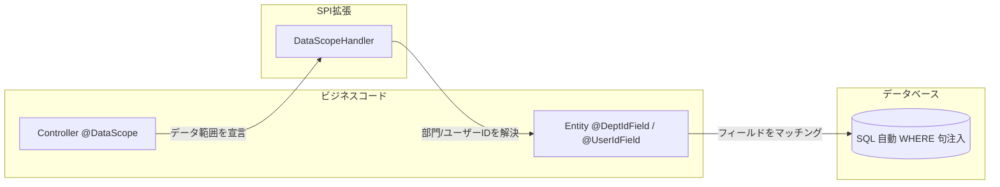
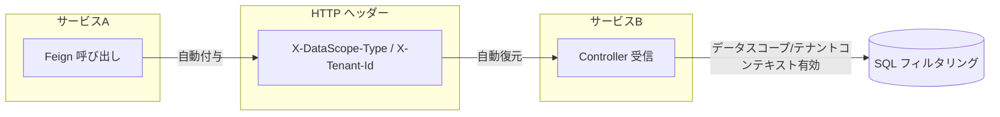

# spring-whale-database

spring-whale データベース拡張フレームワーク。JPA エンティティ基底クラス、動的クエリラッパー、データスコープフィルタリング、マルチテナント分離、Flyway
耐障害性マイグレーション機能を提供します。

---

## モジュール構成

```
spring-whale-database
├── autoconfigure/    自動設定
├── criteria/         JPA 動的クエリ条件インターフェース
├── datascope/        データスコープフィルタリング + マルチテナント分離
└── flyway/           Flyway マイグレーション耐障害性戦略
```

---

## フロー概要

### データスコープフィルタリング



### クロスサービス伝播



> **設計のポイント：** データスコープとテナント分離は SQL レベルで自動的に WHERE
> 句を注入し、ビジネスコードに対して透過的です。クロスサービス呼び出し時は、データスコープコンテキストが HTTP
> ヘッダー経由で自動伝播され、下流サービスでの再解決が不要です。

---

## コア機能

| 機能                          | 説明                                                                                                               |
|------------------------------|-------------------------------------------------------------------------------------------------------------------|
| **エンティティ基底クラス**        | `BaseEntity`（監査 + 楽観ロック + 論理削除）、`SimpleBaseEntity`（軽量版） → [詳細](doc/jpa-query-wrapper.ja.md#エンティティ基底クラス) |
| **動的クエリ** ⭐               | `JpaQueryWrapper` — MyBatis-Plus スタイルのチェーン可能な API → [詳細](doc/jpa-query-wrapper.ja.md#動的クエリjpaquerywrapper) |
| **型安全ソート**                | `SortUtils` — カンマ区切りソート文字列、フィールドホワイトリスト検証内蔵 → [詳細](doc/jpa-query-wrapper.ja.md#ソートユーティリティsortutils) |
| **データスコープフィルタリング** ⭐ | `@DataScope` — 宣言的データ可視範囲、SQL レベル WHERE 注入、6 レベル → [詳細](doc/datascope.ja.md) |
| **マルチテナント分離** ⭐         | `@TenantIdField` / `@NonTenant` — テナント WHERE 句の自動注入 → [詳細](doc/datascope.ja.md#マルチテナント分離) |
| **クロスサービス伝播**           | データスコープコンテキストが HTTP ヘッダー経由でマイクロサービス間を自動伝播 → [詳細](doc/datascope.ja.md#クロスサービス伝播) |
| **マイクロサービスアーキテクチャ**  | `SmartDataScopeHandler` — キャッシュ優先 + Feign リモート呼び出し + フォールバック → [詳細](doc/datascope.ja.md#マイクロサービスアーキテクチャ) |
| **Flyway 耐障害性**            | マイグレーション失敗をログ記録し起動をブロックせず、イベント駆動リトライ → [詳細](doc/flyway.ja.md) |

---

## データスコープタイプ

| タイプ             | 可視範囲                                      |
|-------------------|----------------------------------------------|
| `SELF`            | ユーザー自身のデータのみ                          |
| `DEPT`            | ユーザーの所属部門                               |
| `DEPT_AND_CHILD`  | ユーザーの所属部門とすべての子部門                  |
| `CUSTOM`          | カスタム範囲                                   |
| `CALLER`          | 上流呼び出し元のデータスコープに委譲（クロスサービス）  |
| `AUTO`            | ユーザーコンテキストから自動推論                    |

---

## クイックスタート

### Maven 依存関係

```xml
<dependency>
    <groupId>io.github.julianzhucode</groupId>
    <artifactId>spring-whale-database</artifactId>
</dependency>
```