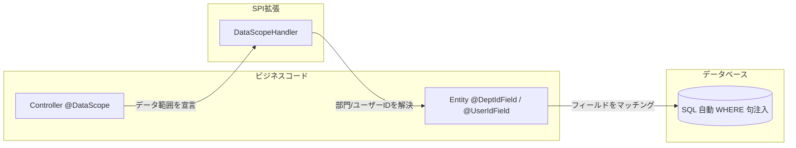
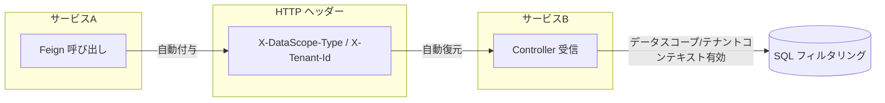

# spring-whale-database

spring-whale データベース拡張フレームワーク。JPA エンティティ基底クラス、動的クエリラッパー、データスコープフィルタリング、マルチテナント分離、Flyway 耐障害性マイグレーション機能を提供します。

---

## モジュール構成

```
spring-whale-database
├── autoconfigure/    自動設定
├── criteria/         JPA 動的クエリ条件インターフェース
├── datascope/        データスコープフィルタリング + マルチテナント分離
└── flyway/           Flyway マイグレーション耐障害性戦略
```

---

## フロー概要

### データスコープフィルタリング



### クロスサービス伝播



> **設計のポイント：** データスコープとテナント分離は SQL レベルで自動的に WHERE 句を注入し、ビジネスコードに対して透過的です。クロスサービス呼び出し時は、データスコープコンテキストが HTTP ヘッダー経由で自動伝播され、下流サービスでの再解決が不要です。

---

## コア機能

- **エンティティ基底クラス**：`BaseEntity` は自動監査（作成者/日時、更新者/日時）、楽観ロック（`@Version`）、論理削除（`@SQLDelete` + `@SQLRestriction`）を提供；`SimpleBaseEntity` は軽量版（ID + 作成者/日時 + 楽観ロックのみ）
- **MyBatis-Plus スタイル動的クエリ**：`JpaQueryWrapper` は JPA Criteria API 上でチェーン可能な条件構築を提供し、eq、ne、like、in、between、groupBy、having、distinct、or、and などの全操作をサポート
- **型安全ソート**：`SortUtils` はカンマ区切り文字列から Spring Data `Sort` を構築し、フィールドホワイトリスト検証を内蔵
- **宣言的データスコープ**：`@DataScope` アノテーションでエンドポイントのデータ可視範囲を宣言、SELF / DEPT / DEPT_AND_CHILD / CUSTOM / CALLER / AUTO の6レベルをサポート
- **マルチテナント分離**：`@TenantIdField` でエンティティのテナントフィールドを指定、フレームワークが自動的にテナント WHERE 句を注入；`@NonTenant` で指定エンドポイントのテナントフィルタリングをスキップ
- **クロスサービス伝播**：データスコープとテナントコンテキストが HTTP ヘッダー経由でマイクロサービス間を自動伝播、下流サービスでの再解決不要
- **Flyway 耐障害性**：マイグレーション失敗時にエラーログを記録しアプリケーション起動をブロックせず、イベント駆動リトライをサポート；オプションで `spring-whale-event` フレームワークと統合し、イベント永続化・リトライ機構・分散シナリオに対応

---

## クイックスタート

### 1. Maven 依存関係

```xml
<dependency>
    <groupId>io.github.julianzhucode</groupId>
    <artifactId>spring-whale-database</artifactId>
</dependency>
```

### 2. エンティティ基底クラス

```java

// 完全版：監査 + 楽観ロック + 論理削除
@Entity
@Table(name = "sys_user")
public class SysUser extends BaseEntity {
    private String username;
    private String email;
}

// 軽量版：ID + 作成者/日時 + 楽観ロックのみ
@Entity
@Table(name = "sys_config")
public class SysConfig extends SimpleBaseEntity {
    private String configKey;
    private String configValue;
}
```

> **BaseEntity の自動動作：** `@PrePersist` で `createTime`、`updateTime`、`createBy`、`updateBy` を自動設定；`@PreUpdate` で `updateTime`、`updateBy` を自動更新；`@SQLDelete` で DELETE を `UPDATE SET del_flag = 1` に変換；`@SQLRestriction` で `del_flag = 0` のレコードを自動フィルタリング。

### 3. 動的クエリ（JpaQueryWrapper）

```java

@Autowired
private UserRepository userRepository;

// 基本クエリ
Specification<User> spec = JpaQueryWrapper.of(User.class)
        .eq(User::getStatus, 1)
        .like(User::getName, "zhang")
        .orderByDesc(User::getCreateTime)
        .build();
Page<User> page = userRepository.findAll(spec, pageable);

// 条件付きクエリ（condition が false の場合はスキップ）
Specification<User> spec2 = JpaQueryWrapper.of(User.class)
        .eq(name != null, User::getName, name)
        .gt(minAge > 0, User::getAge, minAge)
        .build();

// OR クエリ
Specification<User> spec3 = JpaQueryWrapper.of(User.class)
        .or()
        .eq(User::getStatus, 0)
        .eq(User::getStatus, 2)
        .build();

// ネスト条件
Specification<User> spec4 = JpaQueryWrapper.of(User.class)
        .eq(User::getStatus, 1)
        .and(nested -> nested
                .like(User::getName, "zhang")
                .or()
                .like(User::getEmail, "zhang"))
        .build();
```

### 4. ソートユーティリティ（SortUtils）

```java

// フロントエンドパラメータ形式："field1,asc,field2,desc"
Sort sort = SortUtils.buildSort("createTime,desc,id,asc");

// ホワイトリスト検証付き（指定フィールドのみ許可）
Sort sort2 = SortUtils.buildSort("createTime,desc", Set.of("id", "createTime", "name"));

// ソートフィールドと方向の取得
String field = SortUtils.getSortField(sort);       // "createTime"
String direction = SortUtils.getSortDirection(sort); // "desc"
```

### 5. データスコープ設定（application.yml）

```yaml
spring:
  whale:
    database:
      datascope:
        # データスコープフィルタリングを有効化（デフォルト: true）
        enabled: true
        # クロスサービス伝送を有効化（デフォルト: true）
        transmit-enabled: true
        # データスコープタイプヘッダー（デフォルト: X-DataScope-Type）
        scope-type-header: X-DataScope-Type
        # モジュールヘッダー（デフォルト: X-DataScope-Module）
        module-header: X-DataScope-Module
        # テナント分離を有効化（デフォルト: true）
        tenant-enabled: true
        # テナントIDヘッダー（デフォルト: X-Tenant-Id）
        tenant-id-header: X-Tenant-Id
```

### 6. データスコープの宣言

```java

// エンティティに部門/ユーザーフィールドを指定
@Entity
@Table(name = "sys_order")
public class Order extends BaseEntity {
    private String orderNo;

    @DeptIdField   // 部門フィールドを宣言
    private Integer deptId;

    @UserIdField   // ユーザーフィールドを宣言
    private Integer userId;
}

// コントローラーにデータ範囲を宣言
@RestController
@RequestMapping("/orders")
public class OrderController {

    // 本人のデータのみ表示
    @DataScope(scopeType = DataScopeType.SELF, module = "order")
    @GetMapping("/my")
    public List<Order> listMyOrders() { ... }

    // 部門および子部門のデータを表示
    @DataScope(scopeType = DataScopeType.DEPT_AND_CHILD, module = "order")
    @GetMapping("/dept")
    public List<Order> listDeptOrders() { ... }

    // 上流サービスのデータスコープに委譲（マイクロサービスシナリオ）
    @DataScope(scopeType = DataScopeType.CALLER, module = "order")
    @GetMapping("/all")
    public List<Order> listAllOrders() { ... }
}
```

### 7. カスタムデータスコープハンドラー

```java

@Component
public class MyDataScopeHandler implements DataScopeHandler {

    @Autowired
    private DeptService deptService;

    @Override
    public List<Object> resolveDeptIds(DataScopeType scopeType, String module) {
        return switch (scopeType) {
            case SELF -> List.of();
            case DEPT -> List.of(getCurrentDeptId());
            case DEPT_AND_CHILD -> deptService.getChildDeptIds(getCurrentDeptId());
            case CUSTOM -> resolveCustomDeptIds(module);  // カスタムロジック
            default -> List.of();
        };
    }

    private Integer getCurrentDeptId() {
        return AuthUtil.getDeptId();
    }
}
```

### 8. マルチテナント分離

```java

// エンティティにテナントフィールドを指定
@Entity
@Table(name = "sys_product")
public class Product extends BaseEntity {
    private String productName;

    @TenantIdField   // テナントフィールドを宣言
    private Integer tenantId;
}

// テナントフィルタリングをスキップ（グローバルデータエンドポイント）
@RestController
@RequestMapping("/global")
public class GlobalConfigController {

    @NonTenant
    @GetMapping("/config")
    public List<Config> listGlobalConfig() { ... }
}
```

> **テナントフィルタリングメカニズム：** フレームワークは SQL レベルで自動的に `tenant_id = ?` を注入します。同一エンティティに複数のテナントフィールド（例：`tenant_id` と `target_tenant_id`）を指定でき、条件は OR で結合されます。

### 9. Flyway 耐障害性マイグレーション

モジュール導入後自動的に有効化され、追加設定は不要です。マイグレーション失敗時にフレームワークは自動的に：

1. エラーログを `flyway_error_log` テーブルに書き込み
2. `FlywayMigrationEvent` イベントを発行（リスナーでアラート通知が可能）
3. アプリケーションの正常起動を許可し、マイグレーション失敗でブロックしない

> **テーブル作成の推奨：** `flyway_error_log` テーブルはマイグレーション失敗ログを記録するためのものです。初回マイグレーションスクリプトでの作成を推奨します。

```sql
CREATE TABLE flyway_error_log
(
    id          BIGINT AUTO_INCREMENT PRIMARY KEY,
    server_name VARCHAR(128),
    create_time TIMESTAMP,
    message     TEXT
);
```

#### イベントリスニング

デフォルトでは Spring のネイティブイベント機構を使用します。`FlywayMigrationEvent` をリスンするだけです：

```java
@Component
public class FlywayAlertListener implements ApplicationListener<FlywayMigrationEvent> {
    @Override
    public void onApplicationEvent(FlywayMigrationEvent event) {
        if (event.getType() == FlywayEventType.MIGRATION_FAILED) {
            // アラート通知を送信
        }
    }
}
```

#### オプション：spring-whale-event フレームワークとの統合

プロジェクトに `spring-whale-event-core` が同時に導入されている場合、フレームワークは自動的に Flyway イベントをイベントフレームワークにブリッジします。追加設定は不要です：

```xml
<dependency>
    <groupId>io.github.julianzhucode</groupId>
    <artifactId>spring-whale-event-core</artifactId>
</dependency>
```

導入後は `ApplicationListener` の代わりに `AbstractEventListener` を使用してイベントを消費できます：

```java
@Component
public class FlywayAlertListener extends AbstractEventListener<FlywayMigrationEvent> {
    @Override
    protected void onMessage(FlywayMigrationEvent event) {
        if (event.getType() == FlywayEventType.MIGRATION_FAILED) {
            // アラート通知を送信
        }
    }
}
```

> **注意：** イベントフレームワーク導入後、`ApplicationListener` 実装は無効になります。`AbstractEventListener` を統一的に使用してください。

---

## データスコープタイプ

| タイプ               | 可視範囲                                   |
|----------------------|--------------------------------------------|
| `SELF`               | ユーザー本人のデータのみ                     |
| `DEPT`               | ユーザー所属部門                             |
| `DEPT_AND_CHILD`     | ユーザー所属部門およびすべての子部門           |
| `CUSTOM`             | カスタム範囲                                |
| `CALLER`             | 上流呼び出し元のデータスコープに委譲（クロスサービス） |
| `AUTO`               | ユーザーコンテキストから自動推論               |