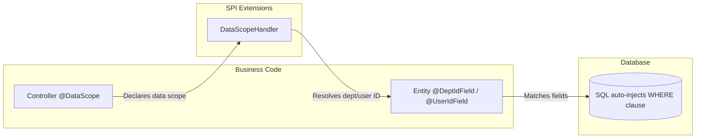
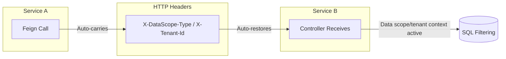

# spring-whale-database

The spring-whale database enhancement framework, providing JPA entity base classes, dynamic query wrappers, data scope filtering, multi-tenant isolation, and Flyway fault-tolerant migration.

---

## Modules

```
spring-whale-database
├── autoconfigure/    Auto-configuration
├── criteria/         JPA dynamic query criteria interfaces
├── datascope/        Data scope filtering + multi-tenant isolation
└── flyway/           Flyway migration fault-tolerant strategy
```

---

## Flow Overview

### Data Scope Filtering



### Cross-Service Propagation



> **Key Design:** Data scope and tenant isolation inject WHERE clauses at the SQL level, transparent to business code. During cross-service calls, data scope context is automatically propagated via HTTP headers, eliminating the need for downstream services to re-resolve it.

---

## Core Capabilities

- **Entity Base Classes**: `BaseEntity` provides automatic auditing (created by/time, updated by/time), optimistic locking (`@Version`), and soft delete (`@SQLDelete` + `@SQLRestriction`); `SimpleBaseEntity` offers a lightweight version (ID + created by/time + optimistic locking only)
- **MyBatis-Plus Style Dynamic Queries**: `JpaQueryWrapper` provides chainable condition building on top of JPA Criteria API, supporting eq, ne, like, in, between, groupBy, having, distinct, or, and and more
- **Type-Safe Sorting**: `SortUtils` supports building Spring Data `Sort` from comma-separated strings, with built-in field whitelist validation
- **Declarative Data Scope**: `@DataScope` annotation declares the data visibility scope of an endpoint, supporting SELF / DEPT / DEPT_AND_CHILD / CUSTOM / CALLER / AUTO six levels
- **Multi-Tenant Isolation**: `@TenantIdField` marks entity tenant fields; the framework auto-injects tenant WHERE clauses; `@NonTenant` skips tenant filtering for specified endpoints
- **Cross-Service Propagation**: Data scope and tenant context are automatically propagated between microservices via HTTP headers, no re-resolution needed downstream
- **Flyway Fault Tolerance**: Migration failures are logged without blocking application startup, with event-driven retry support; optionally integrates with `spring-whale-event` framework for event persistence, retry mechanisms, and distributed scenarios

---

## Quick Start

### 1. Maven Dependency

```xml
<dependency>
    <groupId>io.github.julianzhucode</groupId>
    <artifactId>spring-whale-database</artifactId>
</dependency>
```

### 2. Entity Base Classes

```java

// Full version: auditing + optimistic locking + soft delete
@Entity
@Table(name = "sys_user")
public class SysUser extends BaseEntity {
    private String username;
    private String email;
}

// Lightweight version: ID + created by/time + optimistic locking only
@Entity
@Table(name = "sys_config")
public class SysConfig extends SimpleBaseEntity {
    private String configKey;
    private String configValue;
}
```

> **BaseEntity automatic behaviors:** `@PrePersist` auto-fills `createTime`, `updateTime`, `createBy`, `updateBy`; `@PreUpdate` auto-updates `updateTime`, `updateBy`; `@SQLDelete` converts DELETE to `UPDATE SET del_flag = 1`; `@SQLRestriction` auto-filters `del_flag = 0` records.

### 3. Dynamic Queries (JpaQueryWrapper)

```java

@Autowired
private UserRepository userRepository;

// Basic query
Specification<User> spec = JpaQueryWrapper.of(User.class)
        .eq(User::getStatus, 1)
        .like(User::getName, "zhang")
        .orderByDesc(User::getCreateTime)
        .build();
Page<User> page = userRepository.findAll(spec, pageable);

// Conditional query (skipped when condition is false)
Specification<User> spec2 = JpaQueryWrapper.of(User.class)
        .eq(name != null, User::getName, name)
        .gt(minAge > 0, User::getAge, minAge)
        .build();

// OR query
Specification<User> spec3 = JpaQueryWrapper.of(User.class)
        .or()
        .eq(User::getStatus, 0)
        .eq(User::getStatus, 2)
        .build();

// Nested conditions
Specification<User> spec4 = JpaQueryWrapper.of(User.class)
        .eq(User::getStatus, 1)
        .and(nested -> nested
                .like(User::getName, "zhang")
                .or()
                .like(User::getEmail, "zhang"))
        .build();
```

### 4. Sort Utility (SortUtils)

```java

// Frontend parameter format: "field1,asc,field2,desc"
Sort sort = SortUtils.buildSort("createTime,desc,id,asc");

// With whitelist validation (only allow specified fields)
Sort sort2 = SortUtils.buildSort("createTime,desc", Set.of("id", "createTime", "name"));

// Get sort field and direction
String field = SortUtils.getSortField(sort);       // "createTime"
String direction = SortUtils.getSortDirection(sort); // "desc"
```

### 5. Data Scope Configuration (application.yml)

```yaml
spring:
  whale:
    database:
      datascope:
        # Enable data scope filtering (default: true)
        enabled: true
        # Enable cross-service transmission (default: true)
        transmit-enabled: true
        # Data scope type header (default: X-DataScope-Type)
        scope-type-header: X-DataScope-Type
        # Module header (default: X-DataScope-Module)
        module-header: X-DataScope-Module
        # Enable tenant isolation (default: true)
        tenant-enabled: true
        # Tenant ID header (default: X-Tenant-Id)
        tenant-id-header: X-Tenant-Id
```

### 6. Declaring Data Scope

```java

// Mark department/user fields on entity
@Entity
@Table(name = "sys_order")
public class Order extends BaseEntity {
    private String orderNo;

    @DeptIdField   // Declare department field
    private Integer deptId;

    @UserIdField   // Declare user field
    private Integer userId;
}

// Declare data scope on controller
@RestController
@RequestMapping("/orders")
public class OrderController {

    // View only own data
    @DataScope(scopeType = DataScopeType.SELF, module = "order")
    @GetMapping("/my")
    public List<Order> listMyOrders() { ... }

    // View department and sub-department data
    @DataScope(scopeType = DataScopeType.DEPT_AND_CHILD, module = "order")
    @GetMapping("/dept")
    public List<Order> listDeptOrders() { ... }

    // Delegate to upstream service's data scope (microservice scenario)
    @DataScope(scopeType = DataScopeType.CALLER, module = "order")
    @GetMapping("/all")
    public List<Order> listAllOrders() { ... }
}
```

### 7. Custom Data Scope Handler

```java

@Component
public class MyDataScopeHandler implements DataScopeHandler {

    @Autowired
    private DeptService deptService;

    @Override
    public List<Object> resolveDeptIds(DataScopeType scopeType, String module) {
        return switch (scopeType) {
            case SELF -> List.of();
            case DEPT -> List.of(getCurrentDeptId());
            case DEPT_AND_CHILD -> deptService.getChildDeptIds(getCurrentDeptId());
            case CUSTOM -> resolveCustomDeptIds(module);  // custom logic
            default -> List.of();
        };
    }

    private Integer getCurrentDeptId() {
        return AuthUtil.getDeptId();
    }
}
```

### 8. Multi-Tenant Isolation

```java

// Mark tenant field on entity
@Entity
@Table(name = "sys_product")
public class Product extends BaseEntity {
    private String productName;

    @TenantIdField   // Declare tenant field
    private Integer tenantId;
}

// Skip tenant filtering (global data endpoint)
@RestController
@RequestMapping("/global")
public class GlobalConfigController {

    @NonTenant
    @GetMapping("/config")
    public List<Config> listGlobalConfig() { ... }
}
```

> **Tenant Filtering Mechanism:** The framework auto-injects `tenant_id = ?` at the SQL level, supporting multiple tenant fields on a single entity (e.g., `tenant_id` and `target_tenant_id`), joined by OR.

### 9. Flyway Fault-Tolerant Migration

Automatically enabled upon module inclusion, no extra configuration required. On migration failure, the framework automatically:

1. Writes error logs to the `flyway_error_log` table
2. Publishes a `FlywayMigrationEvent` (listeners can be attached for alerting)
3. Allows the application to start normally without blocking on migration failures

> **Table Suggestion:** The `flyway_error_log` table records migration failure logs; it is recommended to create it in the first migration script.

```sql
CREATE TABLE flyway_error_log
(
    id          BIGINT AUTO_INCREMENT PRIMARY KEY,
    server_name VARCHAR(128),
    create_time TIMESTAMP,
    message     TEXT
);
```

#### Event Listening

By default, Spring's native event mechanism is used. Simply listen for `FlywayMigrationEvent`:

```java
@Component
public class FlywayAlertListener implements ApplicationListener<FlywayMigrationEvent> {
    @Override
    public void onApplicationEvent(FlywayMigrationEvent event) {
        if (event.getType() == FlywayEventType.MIGRATION_FAILED) {
            // Send alert notification
        }
    }
}
```

#### Optional: Integrate spring-whale-event Framework

When `spring-whale-event-core` is also present in the project, the framework automatically bridges Flyway events to the event framework, no extra configuration required:

```xml
<dependency>
    <groupId>io.github.julianzhucode</groupId>
    <artifactId>spring-whale-event-core</artifactId>
</dependency>
```

Benefits of the event framework version:

- **Event Persistence**: Combined with `spring-whale-event-recovery`, events can be persisted to prevent loss
- **Failure Retry**: `FlywayEventRetryListener` consumes retry events via the event framework's `AbstractEventListener`, automatically gaining the framework's retry and recovery capabilities
- **Unified Management**: Events are published and consumed alongside other business events via `EventPublisher`

```java
@Component
public class FlywayAlertListener extends AbstractEventListener<FlywayMigrationEvent> {
    @Override
    protected void onMessage(FlywayMigrationEvent event) {
        if (event.getType() == FlywayEventType.MIGRATION_FAILED) {
            // Send alert notification
        }
    }
}
```

> **Note:** After introducing the event framework, the original `ApplicationListener` implementation will no longer take effect (replaced by `FlywayEventRetryListener`). Please use `AbstractEventListener` uniformly in the event framework version.

---

## Data Scope Types

| Type               | Visibility Scope                                      |
|--------------------|-------------------------------------------------------|
| `SELF`             | User's own data only                                  |
| `DEPT`             | User's department                                     |
| `DEPT_AND_CHILD`   | User's department and all sub-departments             |
| `CUSTOM`           | Custom scope                                          |
| `CALLER`           | Delegated to upstream caller's data scope (cross-service) |
| `AUTO`             | Auto-inferred from user context                       |