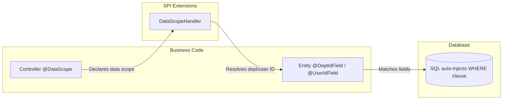
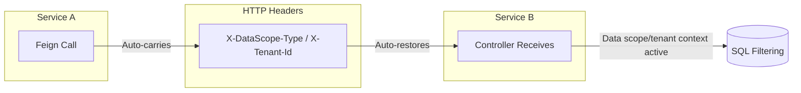

# spring-whale-database

The spring-whale database enhancement framework, providing JPA entity base classes, dynamic query wrappers, data scope
filtering, multi-tenant isolation, and Flyway fault-tolerant migration.

---

## Module Structure

```
spring-whale-database
├── autoconfigure/    Auto-configuration
├── criteria/         JPA dynamic query criteria interfaces
├── datascope/        Data scope filtering + multi-tenant isolation
└── flyway/           Flyway migration fault-tolerant strategy
```

---

## Flow Overview

### Data Scope Filtering



### Cross-Service Propagation



> **Key Design:** Data scope and tenant isolation inject WHERE clauses at the SQL level, transparent to business code.
> During cross-service calls, data scope context is automatically propagated via HTTP headers, eliminating the need for
> downstream services to re-resolve it.

---

## Core Features

| Feature                      | Description                                                                                                   |
|------------------------------|---------------------------------------------------------------------------------------------------------------|
| **Entity Base Classes**      | `BaseEntity` (auditing + optimistic lock + soft delete), `SimpleBaseEntity` (lightweight) → [Details](doc/jpa-query-wrapper.md#entity-base-classes) |
| **Dynamic Queries** ⭐        | `JpaQueryWrapper` — MyBatis-Plus style chainable API on JPA Criteria → [Details](doc/jpa-query-wrapper.md#dynamic-queries-jpaquerywrapper) |
| **Type-Safe Sorting**        | `SortUtils` — comma-separated sort string with field whitelist validation → [Details](doc/jpa-query-wrapper.md#sort-utility-sortutils) |
| **Data Scope Filtering** ⭐   | `@DataScope` — declarative data visibility, SQL-level WHERE injection, 6 scope levels → [Details](doc/datascope.md) |
| **Multi-Tenant Isolation** ⭐ | `@TenantIdField` / `@NonTenant` — automatic tenant WHERE clause injection → [Details](doc/datascope.md#multi-tenant-isolation) |
| **Cross-Service Propagation** | Data scope context auto-propagated between microservices via HTTP headers → [Details](doc/datascope.md#cross-service-propagation) |
| **Microservice Architecture** | `SmartDataScopeHandler` — cache-first + Feign remote call + fallback mechanism → [Details](doc/datascope.md#microservice-architecture) |
| **Flyway Fault Tolerance**   | Migration failures logged but don't block startup, event-driven retry → [Details](doc/flyway.md) |

---

## Data Scope Types

| Type             | Visibility Scope                                           |
|------------------|------------------------------------------------------------|
| `SELF`           | User's own data only                                       |
| `DEPT`           | User's department                                          |
| `DEPT_AND_CHILD` | User's department and all sub-departments                  |
| `CUSTOM`         | Custom scope                                               |
| `CALLER`         | Delegated to upstream caller's data scope (cross-service)  |
| `AUTO`           | Auto-inferred from user context                            |

---

## Quick Start

### Maven Dependency

```xml
<dependency>
    <groupId>io.github.julianzhucode</groupId>
    <artifactId>spring-whale-database</artifactId>
</dependency>
```