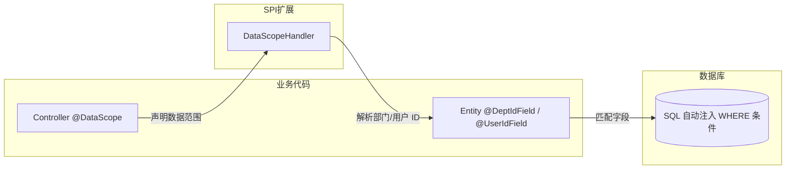
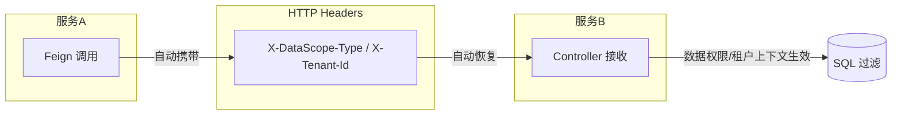

# spring-whale-database

spring-whale 数据库增强框架，提供 JPA 实体基类、动态查询包装器、数据权限过滤、多租户隔离以及 Flyway 容错迁移能力。

---

## 模块说明

```
spring-whale-database
├── autoconfigure/    自动装配
├── criteria/         JPA 动态查询条件接口
├── datascope/        数据权限过滤 + 多租户隔离
└── flyway/           Flyway 迁移容错策略
```

---

## 流程概览

### 数据权限过滤



### 跨服务传播



> **关键设计：** 数据权限和租户隔离在 SQL 层面自动注入 WHERE 条件，对业务代码透明。跨服务调用时，数据权限上下文通过 HTTP
> Header 自动传递，下游服务无需重复解析。

---

## 核心能力

- **实体基类**：`BaseEntity` 提供自动审计（创建人/时间、更新人/时间）、乐观锁（`@Version`）、逻辑删除（`@SQLDelete` +
  `@SQLRestriction`）；`SimpleBaseEntity` 提供轻量版（仅 ID + 创建人/时间）
- **MyBatis-Plus 风格动态查询**：`JpaQueryWrapper` 在 JPA Criteria API 上提供链式条件构建，支持
  eq、ne、like、in、between、groupBy、having、distinct、or、and 等全套操作
- **类型安全排序**：`SortUtils` 支持逗号分隔字符串构建 Spring Data `Sort`，内置字段白名单安全校验
- **声明式数据权限**：`@DataScope` 注解声明接口的数据可见范围，支持 SELF / DEPT / DEPT_AND_CHILD / CUSTOM / CALLER / AUTO
  六种级别
- **多租户隔离**：`@TenantIdField` 标注实体租户字段，框架自动注入租户 WHERE 条件；`@NonTenant` 跳过指定接口的租户过滤
- **跨服务传播**：数据权限和租户上下文通过 HTTP Header 在微服务间自动传递，下游服务无需重复解析
- **Flyway 容错**：迁移失败时记录错误日志而不阻塞应用启动，支持事件驱动重试；可选集成 `spring-whale-event`
  框架，利用事件持久化和失败重试机制，以及分布式场景

---

## Quick Start

### 1. Maven 依赖

```xml

<dependency>
    <groupId>io.github.julianzhucode</groupId>
    <artifactId>spring-whale-database</artifactId>
</dependency>
```

### 2. 实体基类

```java

// 完整版：审计 + 乐观锁 + 逻辑删除
@Entity
@Table(name = "sys_user")
public class SysUser extends BaseEntity {
    private String username;
    private String email;
}

// 轻量版：仅 ID + 创建人/时间
@Entity
@Table(name = "sys_config")
public class SysConfig extends SimpleBaseEntity {
    private String configKey;
    private String configValue;
}
```

> **BaseEntity 自动行为：** `@PrePersist` 自动填充 `createTime`、`updateTime`、`createBy`、`updateBy`；`@PreUpdate` 自动更新
`updateTime`、`updateBy`；`@SQLDelete` 将 DELETE 转为 `UPDATE SET del_flag = 1`；`@SQLRestriction` 自动过滤 `del_flag = 0`
> 的记录。

### 3. 动态查询（JpaQueryWrapper）

```java

@Autowired
private UserRepository userRepository;

// 基础查询
Specification<User> spec = JpaQueryWrapper.of(User.class)
        .eq(User::getStatus, 1)
        .like(User::getName, "zhang")
        .orderByDesc(User::getCreateTime)
        .build();
Page<User> page = userRepository.findAll(spec, pageable);

// 条件性查询（condition 为 false 时跳过该条件）
Specification<User> spec2 = JpaQueryWrapper.of(User.class)
        .eq(name != null, User::getName, name)
        .gt(minAge > 0, User::getAge, minAge)
        .build();

// OR 查询
Specification<User> spec3 = JpaQueryWrapper.of(User.class)
        .or()
        .eq(User::getStatus, 0)
        .eq(User::getStatus, 2)
        .build();

// 嵌套条件
Specification<User> spec4 = JpaQueryWrapper.of(User.class)
        .eq(User::getStatus, 1)
        .and(nested -> nested
                .like(User::getName, "zhang")
                .or()
                .like(User::getEmail, "zhang"))
        .build();
```

### 4. 排序工具（SortUtils）

```java

// 前端传参格式："field1,asc,field2,desc"
Sort sort = SortUtils.buildSort("createTime,desc,id,asc");

// 带白名单校验（只允许指定字段排序）
Sort sort2 = SortUtils.buildSort("createTime,desc", Set.of("id", "createTime", "name"));

// 获取排序字段和方向
String field = SortUtils.getSortField(sort);       // "createTime"
String direction = SortUtils.getSortDirection(sort); // "desc"
```

### 5. 数据权限配置（application.yml）

```yaml
spring:
  whale:
    database:
      datascope:
        # 是否启用数据权限过滤（默认 true）
        enabled: true
        # 是否启用跨服务传输（默认 true）
        transmit-enabled: true
        # 数据权限类型 Header（默认 X-DataScope-Type）
        scope-type-header: X-DataScope-Type
        # 模块 Header（默认 X-DataScope-Module）
        module-header: X-DataScope-Module
        # 是否启用租户隔离（默认 true）
        tenant-enabled: true
        # 租户 ID Header（默认 X-Tenant-Id）
        tenant-id-header: X-Tenant-Id
```

### 6. 声明数据权限

```java

// 实体标注部门/用户字段
@Entity
@Table(name = "sys_order")
public class Order extends BaseEntity {
    private String orderNo;

    @DeptIdField   // 声明部门字段
    private Integer deptId;

    @UserIdField   // 声明用户字段
    private Integer userId;
}

// Controller 声明数据范围
@RestController
@RequestMapping("/orders")
public class OrderController {

    // 仅查看本人数据
    @DataScope(scopeType = DataScopeType.SELF, module = "order")
    @GetMapping("/my")
    public List<Order> listMyOrders() { ...}

    // 查看本部门及子部门数据
    @DataScope(scopeType = DataScopeType.DEPT_AND_CHILD, module = "order")
    @GetMapping("/dept")
    public List<Order> listDeptOrders() { ...}

    // 委托给上游服务的数据权限（微服务场景）
    @DataScope(scopeType = DataScopeType.CALLER, module = "order")
    @GetMapping("/all")
    public List<Order> listAllOrders() { ...}
}
```

### 7. 自定义数据权限处理器

```java

@Component
public class MyDataScopeHandler implements DataScopeHandler {

    @Autowired
    private DeptService deptService;

    /**
     * 是否跳过部门/用户数据权限过滤。
     * 返回 true 时，不会为 @DeptIdField / @UserIdField 注入 WHERE 条件。
     * 典型场景：平台超级管理员，可查看全部数据。
     */
    @Override
    public boolean skipDataScope() {
        return AuthUtil.hasAuthority("super_admin");
    }

    /**
     * 是否跳过租户过滤。
     * 返回 true 时，不会为 @TenantIdField 注入 WHERE 条件。
     * 典型场景：平台超级管理员，可查看所有租户的数据。
     */
    @Override
    public boolean skipTenantScope() {
        return AuthUtil.hasAuthority("super_admin");
    }

    @Override
    public List<Object> resolveDeptIds(DataScopeType scopeType, String module) {
        return switch (scopeType) {
            case SELF -> List.of();
            case DEPT -> List.of(getCurrentDeptId());
            case DEPT_AND_CHILD -> deptService.getChildDeptIds(getCurrentDeptId());
            case CUSTOM -> resolveCustomDeptIds(module);  // 自定义逻辑
            default -> null;  // null = 无权限，SQL 拦截器注入 WHERE 1=0
        };
    }

    private Integer getCurrentDeptId() {
        return AuthUtil.getDeptId();
    }
}
```

> **关键设计决策：**
>
> - `skipDataScope()` / `skipTenantScope()`：数据权限和租户隔离两个独立开关。租户管理员可以
>   `skipDataScope=true`（查看租户内全部数据）同时 `skipTenantScope=false`（仍受租户隔离限制）。
> - `resolveDeptIds()` 返回 `null` 或空列表 → 用户无任何部门权限，SQL 拦截器注入 `WHERE 1=0`，返回空结果集。
> - `resolveDeptIds()` 返回非空列表 → SQL 拦截器注入 `WHERE dept_field IN (1, 2, 3)`。
> - `DefaultDataScopeHandler` 的 `resolveDeptIds()` 返回 `null`（无权限），需注册自定义 `DataScopeHandler` Bean 覆盖。

### 8. 多租户隔离

```java

// 实体标注租户字段
@Entity
@Table(name = "sys_product")
public class Product extends BaseEntity {
    private String productName;

    @TenantIdField   // 声明租户字段
    private Integer tenantId;
}

// 跳过租户过滤（全局数据接口）
@RestController
@RequestMapping("/global")
public class GlobalConfigController {

    @NonTenant
    @GetMapping("/config")
    public List<Config> listGlobalConfig() { ...}
}
```

> **租户过滤机制：** 框架在 SQL 层面自动注入 `tenant_id = ?` 条件，支持同一实体多租户字段（如 `tenant_id`
> 和 `target_tenant_id`），条件之间以 OR 连接。

### 9. Flyway 容错迁移

引入模块后自动生效，无需额外配置。迁移失败时框架自动：

1. 将错误日志写入 `flyway_error_log` 表
2. 发布 `FlywayMigrationEvent` 事件（可监听该事件实现告警）
3. 允许应用正常启动，不因迁移失败而阻塞

> **建表建议：** `flyway_error_log` 表用于记录迁移失败日志，建议在首次迁移脚本中创建。

```sql
CREATE TABLE flyway_error_log
(
    id          BIGINT AUTO_INCREMENT PRIMARY KEY,
    server_name VARCHAR(128),
    create_time TIMESTAMP,
    message     TEXT
);
```

#### 事件监听

默认使用 Spring 原生事件机制，监听 `FlywayMigrationEvent` 即可：

```java

@Component
public class FlywayAlertListener implements ApplicationListener<FlywayMigrationEvent> {
    @Override
    public void onApplicationEvent(FlywayMigrationEvent event) {
        if (event.getType() == FlywayEventType.MIGRATION_FAILED) {
            // 发送告警通知
        }
    }
}
```

#### 可选：集成 spring-whale-event 框架

当项目中同时引入 `spring-whale-event-core` 时，框架自动将 Flyway 事件桥接到事件框架，无需额外配置：

```xml

<dependency>
    <groupId>io.github.julianzhucode</groupId>
    <artifactId>spring-whale-event-core</artifactId>
</dependency>
```

引入后可使用 `AbstractEventListener` 替代 `ApplicationListener` 消费事件：

```java

@Component
public class FlywayAlertListener extends AbstractEventListener<FlywayMigrationEvent> {
    @Override
    protected void onMessage(FlywayMigrationEvent event) {
        if (event.getType() == FlywayEventType.MIGRATION_FAILED) {
            // 发送告警通知
        }
    }
}
```

> **注意：** 引入事件框架后，`ApplicationListener` 实现将不再生效，请统一使用 `AbstractEventListener`。

---

## 数据权限类型

| 类型               | 可见范围                 |
|------------------|----------------------|
| `SELF`           | 仅用户本人数据              |
| `DEPT`           | 用户所属部门               |
| `DEPT_AND_CHILD` | 用户所属部门及所有子部门         |
| `CUSTOM`         | 自定义范围                |
| `CALLER`         | 委托给上游调用方的数据权限（跨服务场景） |
| `AUTO`           | 从用户上下文自动推断           |