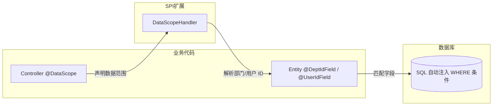
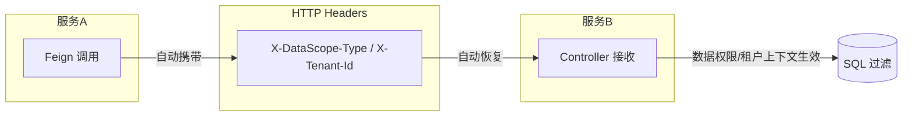

# spring-whale-database

spring-whale 数据库增强框架，提供 JPA 实体基类、动态查询包装器、数据权限过滤、多租户隔离以及 Flyway 容错迁移能力。

---

## 模块结构

```
spring-whale-database
├── autoconfigure/    自动装配
├── criteria/         JPA 动态查询条件接口
├── datascope/        数据权限过滤 + 多租户隔离
└── flyway/           Flyway 迁移容错策略
```

---

## 流程概览

### 数据权限过滤



### 跨服务传播



> **关键设计：** 数据权限和租户隔离在 SQL 层面自动注入 WHERE 条件，对业务代码透明。跨服务调用时，数据权限上下文通过 HTTP
> Header 自动传递，下游服务无需重复解析。

---

## 核心能力

| 能力                        | 说明                                                                                                         |
|----------------------------|-------------------------------------------------------------------------------------------------------------|
| **实体基类**                  | `BaseEntity`（审计 + 乐观锁 + 逻辑删除）、`SimpleBaseEntity`（轻量版） → [详情](doc/jpa-query-wrapper.zn.md#实体基类) |
| **动态查询** ⭐               | `JpaQueryWrapper` — MyBatis-Plus 风格链式 API → [详情](doc/jpa-query-wrapper.zn.md#动态查询jpaquerywrapper) |
| **类型安全排序**               | `SortUtils` — 逗号分隔排序字符串，内置字段白名单校验 → [详情](doc/jpa-query-wrapper.zn.md#排序工具sortutils) |
| **数据权限过滤** ⭐            | `@DataScope` — 声明式数据可见范围，SQL 层面 WHERE 注入，6 种级别 → [详情](doc/datascope.zn.md) |
| **多租户隔离** ⭐              | `@TenantIdField` / `@NonTenant` — 自动注入租户 WHERE 条件 → [详情](doc/datascope.zn.md#多租户隔离) |
| **跨服务传播**                | 数据权限上下文通过 HTTP Header 在微服务间自动传递 → [详情](doc/datascope.zn.md#跨服务传播) |
| **微服务架构**                | `SmartDataScopeHandler` — 缓存优先 + Feign 远程调用 + 降级容错 → [详情](doc/datascope.zn.md#微服务架构) |
| **Flyway 容错**              | 迁移失败记录日志不阻塞启动，事件驱动重试 → [详情](doc/flyway.zn.md) |

---

## 数据权限类型

| 类型               | 可见范围                 |
|------------------|----------------------|
| `SELF`           | 仅用户本人数据              |
| `DEPT`           | 用户所属部门               |
| `DEPT_AND_CHILD` | 用户所属部门及所有子部门         |
| `CUSTOM`         | 自定义范围                |
| `CALLER`         | 委托给上游调用方的数据权限（跨服务场景） |
| `AUTO`           | 从用户上下文自动推断           |

---

## 快速开始

### Maven 依赖

```xml
<dependency>
    <groupId>io.github.julianzhucode</groupId>
    <artifactId>spring-whale-database</artifactId>
</dependency>
```