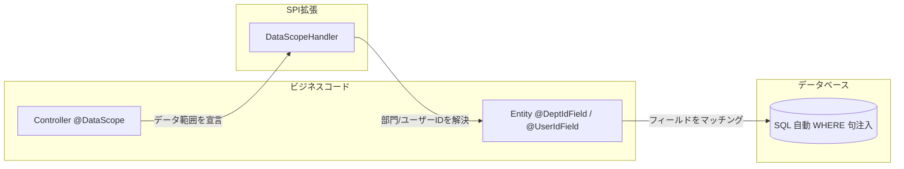
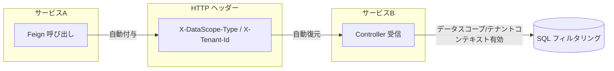

# データスコープ & マルチテナント分離

Spring Whale は宣言的データスコープフィルタリングとマルチテナント分離を SQL レベルで提供し、ビジネスコードに対して透過的です。

## 目次

- [機能](#機能)
- [アーキテクチャ](#アーキテクチャ)
- [設定](#設定)
- [データスコープの宣言](#データスコープの宣言)
- [データスコープタイプ](#データスコープタイプ)
- [カスタムデータスコープハンドラー](#カスタムデータスコープハンドラー)
- [マルチテナント分離](#マルチテナント分離)
- [クロスサービス伝播](#クロスサービス伝播)
- [マイクロサービスアーキテクチャ](#マイクロサービスアーキテクチャ)
- [Bean アセンブリ](#bean-アセンブリ)

## 機能

- ✅ **宣言的 @DataScope** — アノテーション一つでエンドポイントのデータ可視範囲を宣言
- ✅ **6つのスコープレベル** — SELF / DEPT / DEPT_AND_CHILD / CUSTOM / CALLER / AUTO
- ✅ **SQL レベルフィルタリング** — WHERE 句が SQL レベルで自動注入され、ビジネスコードに透過的
- ✅ **マルチテナント分離** — `@TenantIdField` でテナント WHERE 句を自動注入
- ✅ **クロスサービス伝播** — データスコープコンテキストが HTTP ヘッダー経由でマイクロサービス間を自動伝播
- ✅ **プラグ可能なハンドラー** — SPI ベースの `DataScopeHandler` インターフェースでカスタムスコープ解決ロジック
- ✅ **マイクロサービスサポート** — `SmartDataScopeHandler` キャッシュ優先 + Feign リモート呼び出し + フォールバック
- ✅ **条件付きアセンブリ** — 利用可能なモジュールと設定に基づいて適切なハンドラーを自動選択

## アーキテクチャ

### データスコープフィルタリングフロー



### クロスサービス伝播



> **設計のポイント：** データスコープとテナント分離は SQL レベルで自動的に WHERE
> 句を注入し、ビジネスコードに対して透過的です。クロスサービス呼び出し時は、データスコープコンテキストが HTTP
> ヘッダー経由で自動伝播され、下流サービスでの再解決が不要です。

## 設定

`application.yml` に以下の設定を追加します：

```yaml
spring:
  whale:
    database:
      datascope:
        # データスコープフィルタリングを有効化（デフォルト: true）
        enabled: true
        # クロスサービス伝播を有効化（デフォルト: true）
        transmit-enabled: true
        # データスコープタイプヘッダー（デフォルト: X-DataScope-Type）
        scope-type-header: X-DataScope-Type
        # モジュールヘッダー（デフォルト: X-DataScope-Module）
        module-header: X-DataScope-Module
        # テナント分離を有効化（デフォルト: true）
        tenant-enabled: true
        # テナント ID ヘッダー（デフォルト: X-Tenant-Id）
        tenant-id-header: X-Tenant-Id
        # リモート RBAC サービス URL（マイクロサービスモード）
        remote-rbac-url: http://rbac-service
        # プライマリキーのキャッシュ TTL（デフォルト: 5m）
        cache-ttl: 5m
        # フォールバックキーのキャッシュ TTL（デフォルト: 30m）
        fallback-cache-ttl: 30m
```

### 設定項目

| 項目                   | 型       | デフォルト          | 説明                             |
|------------------------|----------|---------------------|----------------------------------|
| `enabled`              | boolean  | true                | データスコープフィルタリングを有効化    |
| `transmit-enabled`     | boolean  | true                | クロスサービスヘッダー伝播を有効化      |
| `scope-type-header`    | String   | X-DataScope-Type    | データスコープタイプヘッダー名         |
| `module-header`        | String   | X-DataScope-Module  | モジュールヘッダー名                 |
| `tenant-enabled`       | boolean  | true                | テナント分離を有効化                 |
| `tenant-id-header`     | String   | X-Tenant-Id         | テナント ID ヘッダー名              |
| `remote-rbac-url`      | String   | (なし)              | リモート RBAC サービス URL          |
| `cache-ttl`            | Duration | 5m                  | プライマリキャッシュ TTL            |
| `fallback-cache-ttl`   | Duration | 30m                 | フォールバックキャッシュ TTL         |

## データスコープの宣言

### エンティティアノテーション

エンティティに部門/ユーザーフィールドをマークします：

```java
// エンティティに部門/ユーザーフィールドをマーク
@Entity
@Table(name = "sys_order")
public class Order extends BaseEntity {
    private String orderNo;

    @DeptIdField   // 部門フィールドを宣言
    private Integer deptId;

    @UserIdField   // ユーザーフィールドを宣言
    private Integer userId;
}

// エンティティ自体がスコープ主体の場合（例: GroupEntity が部門である場合）、
// クラスレベルアノテーションを使用して @Id/@GeneratedValue の再宣言を回避：
@Entity
@DeptIdScope        // エンティティ ID = 部門 ID、デフォルト {"id"}
@Table(name = "rbac_group")
public class GroupEntity extends BaseEntity {
    private String name;
    private Integer parentId;
}

// 複数フィールドまたはカスタムフィールド名：
@DeptIdScope({"deptId", "ownerDeptId"})
public class SomeEntity extends BaseEntity { ... }

// @UserIdScope と @TenantIdScope も利用可能
```

### コントローラーアノテーション

コントローラーメソッドでデータスコープを宣言します：

```java
@RestController
@RequestMapping("/orders")
public class OrderController {

    // 自分のデータのみ表示
    @DataScope(scopeType = DataScopeType.SELF, module = "order")
    @GetMapping("/my")
    public List<Order> listMyOrders() { ...}

    // 部門と子部門のデータを表示
    @DataScope(scopeType = DataScopeType.DEPT_AND_CHILD, module = "order")
    @GetMapping("/dept")
    public List<Order> listDeptOrders() { ...}

    // 上流サービスのデータスコープに委譲（マイクロサービスシナリオ）
    @DataScope(scopeType = DataScopeType.CALLER, module = "order")
    @GetMapping("/all")
    public List<Order> listAllOrders() { ...}
}
```

## データスコープタイプ

| タイプ             | 可視範囲                                      |
|-------------------|----------------------------------------------|
| `SELF`            | ユーザー自身のデータのみ                          |
| `DEPT`            | ユーザーの所属部門                               |
| `DEPT_AND_CHILD`  | ユーザーの所属部門とすべての子部門                  |
| `CUSTOM`          | カスタム範囲                                   |
| `CALLER`          | 上流呼び出し元のデータスコープに委譲（クロスサービス）  |
| `AUTO`            | ユーザーコンテキストから自動推論                    |

## カスタムデータスコープハンドラー

`DataScopeHandler` インターフェースを実装してスコープ解決ロジックをカスタマイズします：

```java
@Component
public class MyDataScopeHandler implements DataScopeHandler {

    @Autowired
    private DeptService deptService;

    /**
     * 部門/ユーザーデータスコープフィルタリングを完全にスキップするかどうか。
     * true の場合、@DeptIdField / @UserIdField に WHERE 句は注入されません。
     * 典型的な使用例：すべてのデータを表示できるプラットフォームスーパー管理者。
     */
    @Override
    public boolean skipDataScope() {
        return AuthUtil.hasAuthority("super_admin");
    }

    /**
     * テナントフィルタリングを完全にスキップするかどうか。
     * true の場合、@TenantIdField に WHERE 句は注入されません。
     * 典型的な使用例：すべてのテナントのデータを表示できるプラットフォームスーパー管理者。
     */
    @Override
    public boolean skipTenantScope() {
        return AuthUtil.hasAuthority("super_admin");
    }

    @Override
    public List<Object> resolveDeptIds(DataScopeType scopeType, String module) {
        return switch (scopeType) {
            case SELF -> List.of();
            case DEPT -> List.of(getCurrentDeptId());
            case DEPT_AND_CHILD -> deptService.getChildDeptIds(getCurrentDeptId());
            case CUSTOM -> resolveCustomDeptIds(module);  // カスタムロジック
            default -> null;  // null = 権限なし、SQL インターセプターが WHERE 1=0 を注入
        };
    }

    private Integer getCurrentDeptId() {
        return AuthUtil.getDeptId();
    }
}
```

> **設計上の重要な決定事項：**
>
> - `skipDataScope()` / `skipTenantScope()`：データスコープとテナント分離の2つの独立したスイッチ。テナント管理者は
>   `skipDataScope=true`（テナント内の全データを表示）かつ `skipTenantScope=false`（テナント分離制限あり）が可能です。
> - `resolveDeptIds()` が `null` または空リストを返す → ユーザーに部門権限なし。SQL インターセプターが
>   `WHERE 1=0` を注入し、空の結果セットを返します。
> - `resolveDeptIds()` が空でないリストを返す → SQL インターセプターが `WHERE dept_field IN (1, 2, 3)` を注入します。
> - `DefaultDataScopeHandler` の `resolveDeptIds()` は `null` を返します（権限なし）。カスタム
>   `DataScopeHandler` Bean を登録して上書きします。

## マルチテナント分離

### エンティティアノテーション

エンティティにテナントフィールドをマークします：

```java
@Entity
@Table(name = "sys_product")
public class Product extends BaseEntity {
    private String productName;

    @TenantIdField   // テナントフィールドを宣言
    private Integer tenantId;
}
```

### テナントフィルタリングのスキップ

グローバルデータエンドポイントでテナントフィルタリングをスキップします：

```java
@RestController
@RequestMapping("/global")
public class GlobalConfigController {

    @NonTenant
    @GetMapping("/config")
    public List<Config> listGlobalConfig() { ...}
}
```

> **テナントフィルタリングメカニズム：** フレームワークは SQL レベルで自動的に `tenant_id = ?`
> を注入し、単一エンティティ上の複数のテナントフィールド（例: `tenant_id` と `target_tenant_id`）を OR で結合します。

## クロスサービス伝播

### 動作の仕組み

1. **送信（Feign インターセプター）：** `@FeignClient` 経由で下流サービスを呼び出す際、
   `DataScopeFeignInterceptor` が自動的に `ThreadLocal` から現在の `DataScopeContext` を読み取り、
   HTTP ヘッダー（`X-DataScope-Type`、`X-DataScope-Module`、`X-Tenant-Id`）として設定します。

2. **受信（サーバーインターセプター）：** 下流サービスがリクエストを受信すると、
   `DataScopeServerInterceptor` が HTTP ヘッダーを読み取り、現在のスレッドの `DataScopeContext` を復元します。

3. **SQL フィルタリング：** 復元されたコンテキストは SQL インターセプターによって使用され、WHERE 句を注入します。
   これにより下流サービスは呼び出し元のスコープに従ってデータをフィルタリングし、再解決は不要です。

### 有効化/無効化

```yaml
spring:
  whale:
    database:
      datascope:
        transmit-enabled: true   # クロスサービス伝播を有効化（デフォルト: true）
```

`transmit-enabled` が `false` の場合、Feign インターセプターはデータスコープヘッダーを付与せず、
下流サービスは独自にデータスコープを解決する必要があります。

## マイクロサービスアーキテクチャ

### 3段階のハンドラー選択

下流サービスに RBAC モジュールがデプロイされていない場合、`SmartDataScopeHandler` がキャッシュ優先 +
リモート呼び出し + フォールバックメカニズムを提供します：

```
リクエスト → DataScopeAspect → SmartDataScopeHandler
  ├── WhaleCacheManager.get("dataScope") → キャッシュヒット → キャッシュ結果を返す
  │     ↑ Redis 共有キャッシュ、RBAC サービスが書き込み
  └── キャッシュミス → DataScopeFeignClient → RBAC DataScopeController → 結果をキャッシュ
```

### フォールバックメカニズム

リモート RBAC サービスが一時的に利用不可の場合の高可用性を確保するため：

- **成功時：** プライマリキー（短 TTL、デフォルト 5m）+ フォールバックキー（長 TTL、デフォルト 30m）を二重書き込み
- **失敗時：** フォールバックキーを読み取り → 期限切れでもキャッシュ値を返す → アクセス拒否を回避

これにより、一時的なネットワーク障害や RBAC サービスの再起動がデータアクセス障害を引き起こしません。

### キャッシュキー設計

| キータイプ       | フォーマット                                  | TTL  | 目的             |
|-----------------|---------------------------------------------|------|------------------|
| プライマリキー    | `dept:{userId}:{scopeType}:{module}`         | 5m   | 最新データ、短 TTL  |
| フォールバックキー | `fallback:dept:{userId}:{scopeType}:{module}` | 30m | 災害復旧、長 TTL   |

### 設定

```yaml
spring:
  whale:
    database:
      datascope:
        remote-rbac-url: http://rbac-service   # RBAC サービス URL
        cache-ttl: 5m                          # プライマリキャッシュ TTL
        fallback-cache-ttl: 30m                # フォールバックキャッシュ TTL
```

## Bean アセンブリ

### アセンブリ戦略

フレームワークは利用可能なモジュールと設定に基づいて適切な `DataScopeHandler` 実装を自動選択します：

| 条件                                              | ハンドラー               | 説明                                   |
|--------------------------------------------------|-------------------------|----------------------------------------|
| RBAC モジュールが存在                              | `RBACDataScopeHandler`  | JPA 直接クエリ、共有キャッシュに書き込み      |
| `remote-rbac-url` 設定済み、RBAC モジュールなし     | `SmartDataScopeHandler` | キャッシュ優先 + Feign リモート呼び出し + フォールバック |
| どちらもなし                                       | `DefaultDataScopeHandler` | デグレード、null を返す（権限なし）           |

### 条件付きアノテーション

- `RBACDataScopeHandler` — `@Component`、RBAC モジュール存在時に登録
- `SmartDataScopeHandler` — `@ConditionalOnBean(DataScopeRemoteApi.class)` + `@ConditionalOnMissingBean(RBACDataScopeHandler.class)`
- `DefaultDataScopeHandler` — `@ConditionalOnMissingBean(DataScopeHandler.class)`、常にフォールバックとして登録

### DataScopeController

RBAC モジュールに配置され、`DataScopeController` は `DataScopeRemoteApi` インターフェースを実装し、
`@ConditionalOnProperty(prefix = "spring.whale.database.datascope", name = "remote-rbac-url")` によってアクティブ化されます。
`RBACDataScopeHandler` と競合しません：
- `RBACDataScopeHandler` は同じモジュール内の `@Component` で、ローカル JPA クエリに使用
- `DataScopeController` は REST コントローラーで、リモート呼び出し用に同じ API を公開
- 両者は異なる呼び出しパスを提供：ローカル JPA vs. リモート HTTP