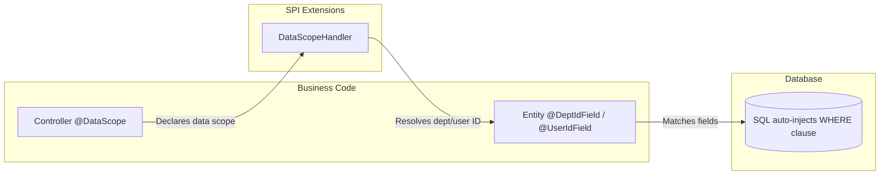
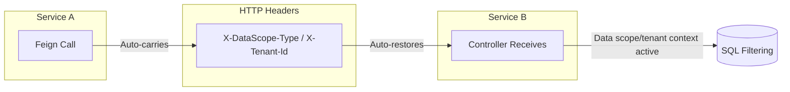

# Data Scope & Multi-Tenant Isolation

Spring Whale provides declarative data scope filtering and multi-tenant isolation at the SQL level, transparent to
business code.

## Table of Contents

- [Features](#features)
- [Architecture](#architecture)
- [Configuration](#configuration)
- [Declaring Data Scope](#declaring-data-scope)
- [Data Scope Types](#data-scope-types)
- [Custom Data Scope Handler](#custom-data-scope-handler)
- [Multi-Tenant Isolation](#multi-tenant-isolation)
- [Cross-Service Propagation](#cross-service-propagation)
- [Microservice Architecture](#microservice-architecture)
- [Bean Assembly](#bean-assembly)

## Features

- ✅ **Declarative @DataScope** — Declare data visibility on controller methods with a single annotation
- ✅ **Six Scope Levels** — SELF / DEPT / DEPT_AND_CHILD / CUSTOM / CALLER / AUTO
- ✅ **SQL-Level Filtering** — WHERE clauses are injected at the SQL level, transparent to business code
- ✅ **Multi-Tenant Isolation** — `@TenantIdField` auto-injects tenant WHERE clauses
- ✅ **Cross-Service Propagation** — Data scope context automatically propagates between microservices via HTTP headers
- ✅ **Pluggable Handler** — SPI-based `DataScopeHandler` interface for custom scope resolution logic
- ✅ **Microservice Support** — `SmartDataScopeHandler` with cache-first + Feign remote call + fallback mechanism
- ✅ **Conditional Assembly** — Auto-selects the appropriate handler based on available modules and configuration

## Architecture

### Data Scope Filtering Flow



### Cross-Service Propagation



> **Key Design:** Data scope and tenant isolation inject WHERE clauses at the SQL level, transparent to business code.
> During cross-service calls, data scope context is automatically propagated via HTTP headers, eliminating the need for
> downstream services to re-resolve it.

## Configuration

Add the following configuration to `application.yml`:

```yaml
spring:
  whale:
    database:
      datascope:
        # Enable data scope filtering (default: true)
        enabled: true
        # Enable cross-service transmission (default: true)
        transmit-enabled: true
        # Data scope type header (default: X-DataScope-Type)
        scope-type-header: X-DataScope-Type
        # Module header (default: X-DataScope-Module)
        module-header: X-DataScope-Module
        # Enable tenant isolation (default: true)
        tenant-enabled: true
        # Tenant ID header (default: X-Tenant-Id)
        tenant-id-header: X-Tenant-Id
        # Remote RBAC service URL (microservice mode)
        remote-rbac-url: http://rbac-service
        # Cache TTL for primary key (default: 5m)
        cache-ttl: 5m
        # Cache TTL for fallback key (default: 30m)
        fallback-cache-ttl: 30m
```

### Configuration Items

| Item                  | Type     | Default             | Description                                               |
|-----------------------|----------|---------------------|-----------------------------------------------------------|
| `enabled`             | boolean  | true                | Enable data scope filtering                               |
| `transmit-enabled`    | boolean  | true                | Enable cross-service header transmission                  |
| `scope-type-header`   | String   | X-DataScope-Type    | Header name for data scope type                           |
| `module-header`       | String   | X-DataScope-Module  | Header name for module                                    |
| `tenant-enabled`      | boolean  | true                | Enable tenant isolation                                   |
| `tenant-id-header`    | String   | X-Tenant-Id         | Header name for tenant ID                                 |
| `remote-rbac-url`     | String   | (none)              | Remote RBAC service URL for microservice mode             |
| `cache-ttl`           | Duration | 5m                  | Cache TTL for primary key                                 |
| `fallback-cache-ttl`  | Duration | 30m                 | Cache TTL for fallback key                                |

## Declaring Data Scope

### Entity Annotations

Mark department/user fields on entity:

```java
// Mark department/user fields on entity
@Entity
@Table(name = "sys_order")
public class Order extends BaseEntity {
    private String orderNo;

    @DeptIdField   // Declare department field
    private Integer deptId;

    @UserIdField   // Declare user field
    private Integer userId;
}

// When the entity itself IS the scope subject (e.g. GroupEntity is a department),
// use class-level annotations to avoid redeclaring @Id/@GeneratedValue:
@Entity
@DeptIdScope        // entity id = dept id, defaults to {"id"}
@Table(name = "rbac_group")
public class GroupEntity extends BaseEntity {
    private String name;
    private Integer parentId;
}

// Multiple fields or custom field names:
@DeptIdScope({"deptId", "ownerDeptId"})
public class SomeEntity extends BaseEntity { ... }

// Also available: @UserIdScope and @TenantIdScope
```

### Controller Annotations

Declare data scope on controller methods:

```java
@RestController
@RequestMapping("/orders")
public class OrderController {

    // View only own data
    @DataScope(scopeType = DataScopeType.SELF, module = "order")
    @GetMapping("/my")
    public List<Order> listMyOrders() { ...}

    // View department and sub-department data
    @DataScope(scopeType = DataScopeType.DEPT_AND_CHILD, module = "order")
    @GetMapping("/dept")
    public List<Order> listDeptOrders() { ...}

    // Delegate to upstream service's data scope (microservice scenario)
    @DataScope(scopeType = DataScopeType.CALLER, module = "order")
    @GetMapping("/all")
    public List<Order> listAllOrders() { ...}
}
```

## Data Scope Types

| Type             | Visibility Scope                                          |
|------------------|-----------------------------------------------------------|
| `SELF`           | User's own data only                                      |
| `DEPT`           | User's department                                         |
| `DEPT_AND_CHILD` | User's department and all sub-departments                 |
| `CUSTOM`         | Custom scope                                              |
| `CALLER`         | Delegated to upstream caller's data scope (cross-service) |
| `AUTO`           | Auto-inferred from user context                           |

## Custom Data Scope Handler

Implement `DataScopeHandler` interface to customize scope resolution logic:

```java
@Component
public class MyDataScopeHandler implements DataScopeHandler {

    @Autowired
    private DeptService deptService;

    /**
     * Whether to skip department/user data scope filtering entirely.
     * When true, no WHERE clause is injected for @DeptIdField / @UserIdField.
     * Typical usage: platform super administrator who can see all data.
     */
    @Override
    public boolean skipDataScope() {
        return AuthUtil.hasAuthority("super_admin");
    }

    /**
     * Whether to skip tenant filtering entirely.
     * When true, no WHERE clause is injected for @TenantIdField.
     * Typical usage: platform super administrator who can see all tenants' data.
     */
    @Override
    public boolean skipTenantScope() {
        return AuthUtil.hasAuthority("super_admin");
    }

    @Override
    public List<Object> resolveDeptIds(DataScopeType scopeType, String module) {
        return switch (scopeType) {
            case SELF -> List.of();
            case DEPT -> List.of(getCurrentDeptId());
            case DEPT_AND_CHILD -> deptService.getChildDeptIds(getCurrentDeptId());
            case CUSTOM -> resolveCustomDeptIds(module);  // custom logic
            default -> null;  // null = no permission, SQL interceptor injects WHERE 1=0
        };
    }

    private Integer getCurrentDeptId() {
        return AuthUtil.getDeptId();
    }
}
```

> **Key Design Decisions:**
>
> - `skipDataScope()` / `skipTenantScope()`: Two independent switches for data scope and tenant isolation. A tenant admin
>   can `skipDataScope=true` (see all data within the tenant) while `skipTenantScope=false` (still isolated to their
>   tenant).
> - `resolveDeptIds()` returns `null` or empty list → the user has no permission for any department. The SQL
>   interceptor injects `WHERE 1=0`, returning an empty result set.
> - `resolveDeptIds()` returns a non-empty list → the SQL interceptor injects `WHERE dept_field IN (1, 2, 3)`.
> - `DefaultDataScopeHandler` returns `null` from `resolveDeptIds()` (no permission). Override by registering a custom
>   `DataScopeHandler` bean.

## Multi-Tenant Isolation

### Entity Annotations

Mark tenant field on entity:

```java
@Entity
@Table(name = "sys_product")
public class Product extends BaseEntity {
    private String productName;

    @TenantIdField   // Declare tenant field
    private Integer tenantId;
}
```

### Skip Tenant Filtering

Skip tenant filtering for global data endpoints:

```java
@RestController
@RequestMapping("/global")
public class GlobalConfigController {

    @NonTenant
    @GetMapping("/config")
    public List<Config> listGlobalConfig() { ...}
}
```

> **Tenant Filtering Mechanism:** The framework auto-injects `tenant_id = ?` at the SQL level, supporting multiple
> tenant fields on a single entity (e.g., `tenant_id` and `target_tenant_id`), joined by OR.

## Cross-Service Propagation

### How It Works

1. **Outgoing (Feign Interceptor):** When a downstream service is called via `@FeignClient`, the `DataScopeFeignInterceptor`
   automatically reads the current `DataScopeContext` from `ThreadLocal` and sets it as HTTP headers
   (`X-DataScope-Type`, `X-DataScope-Module`, `X-Tenant-Id`).

2. **Incoming (Server Interceptor):** When a downstream service receives the request, the `DataScopeServerInterceptor`
   reads the HTTP headers and restores the `DataScopeContext` in the current thread.

3. **SQL Filtering:** The restored context is used by the SQL interceptor to inject WHERE clauses, so the downstream
   service filters data according to the caller's scope — no re-resolution needed.

### Enabling/Disabling

```yaml
spring:
  whale:
    database:
      datascope:
        transmit-enabled: true   # Enable cross-service transmission (default: true)
```

When `transmit-enabled` is `false`, the Feign interceptor will not carry data scope headers, and the downstream service
will need to resolve data scope independently.

## Microservice Architecture

### Three-Level Handler Selection

When the RBAC module is not deployed with the downstream service, `SmartDataScopeHandler` provides a cache-first +
remote call + fallback mechanism:

```
Request → DataScopeAspect → SmartDataScopeHandler
  ├── WhaleCacheManager.get("dataScope") → Cache Hit → Return cached result
  │     ↑ Redis shared cache, written by RBAC service
  └── Cache Miss → DataScopeFeignClient → RBAC DataScopeController → Cache result
```

### Fallback Mechanism

To ensure high availability when the remote RBAC service is temporarily unavailable:

- **Success:** Dual-write primary key (short TTL, default 5m) + fallback key (long TTL, default 30m)
- **Failure:** Read fallback key → return cached value even if expired → avoid denying access

This ensures that a temporary network issue or RBAC service restart does not cause data access failures.

### Cache Key Design

| Key Type        | Pattern                                    | TTL  | Purpose                       |
|-----------------|--------------------------------------------|------|-------------------------------|
| Primary Key     | `dept:{userId}:{scopeType}:{module}`       | 5m   | Fresh data, short TTL         |
| Fallback Key    | `fallback:dept:{userId}:{scopeType}:{module}` | 30m | Disaster recovery, long TTL   |

### Configuration

```yaml
spring:
  whale:
    database:
      datascope:
        remote-rbac-url: http://rbac-service   # RBAC service URL
        cache-ttl: 5m                          # Primary cache TTL
        fallback-cache-ttl: 30m                # Fallback cache TTL
```

## Bean Assembly

### Assembly Strategy

The framework automatically selects the appropriate `DataScopeHandler` implementation based on available modules and
configuration:

| Condition                                      | Handler                | Description                                |
|------------------------------------------------|------------------------|--------------------------------------------|
| RBAC module present                            | `RBACDataScopeHandler` | JPA direct query, writes to shared cache   |
| `remote-rbac-url` configured, no RBAC module   | `SmartDataScopeHandler` | Cache-first + Feign remote call + fallback |
| Neither                                        | `DefaultDataScopeHandler` | Degradation, returns null (no permission) |

### Conditional Annotations

- `RBACDataScopeHandler` — `@Component`, registered when RBAC module is present
- `SmartDataScopeHandler` — `@ConditionalOnBean(DataScopeRemoteApi.class)` + `@ConditionalOnMissingBean(RBACDataScopeHandler.class)`
- `DefaultDataScopeHandler` — `@ConditionalOnMissingBean(DataScopeHandler.class)`, always registered as fallback

### DataScopeController

Located in the RBAC module, the `DataScopeController` implements `DataScopeRemoteApi` and is activated by
`@ConditionalOnProperty(prefix = "spring.whale.database.datascope", name = "remote-rbac-url")`. It does not conflict with
`RBACDataScopeHandler` because:
- `RBACDataScopeHandler` is a `@Component` in the same module, used for local JPA queries
- `DataScopeController` is a REST controller that exposes the same API for remote calls
- They serve different call paths: local JPA vs. remote HTTP