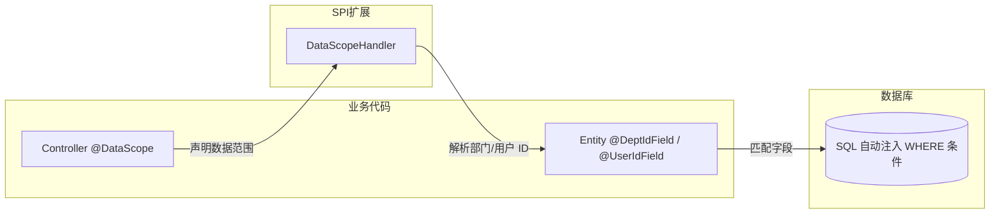
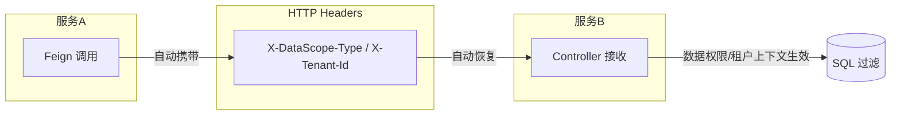

# 数据权限 & 多租户隔离

Spring Whale 提供声明式数据权限过滤和多租户隔离，在 SQL 层面自动注入 WHERE 条件，对业务代码透明。

## 目录

- [特性](#特性)
- [架构](#架构)
- [配置](#配置)
- [声明数据权限](#声明数据权限)
- [数据权限类型](#数据权限类型)
- [自定义数据权限处理器](#自定义数据权限处理器)
- [多租户隔离](#多租户隔离)
- [跨服务传播](#跨服务传播)
- [微服务架构](#微服务架构)
- [Bean 装配策略](#bean-装配策略)

## 特性

- ✅ **声明式 @DataScope** — 一个注解声明接口的数据可见范围
- ✅ **六种权限级别** — SELF / DEPT / DEPT_AND_CHILD / CUSTOM / CALLER / AUTO
- ✅ **SQL 层面过滤** — WHERE 条件在 SQL 层面自动注入，业务代码无感知
- ✅ **多租户隔离** — `@TenantIdField` 自动注入租户 WHERE 条件
- ✅ **跨服务传播** — 数据权限上下文通过 HTTP Header 在微服务间自动传递
- ✅ **可插拔处理器** — 基于 SPI 的 `DataScopeHandler` 接口，支持自定义权限解析逻辑
- ✅ **微服务支持** — `SmartDataScopeHandler` 缓存优先 + Feign 远程调用 + 降级容错机制
- ✅ **条件装配** — 根据可用模块和配置自动选择合适的处理器

## 架构

### 数据权限过滤流程



### 跨服务传播



> **关键设计：** 数据权限和租户隔离在 SQL 层面自动注入 WHERE 条件，对业务代码透明。跨服务调用时，数据权限上下文通过 HTTP
> Header 自动传递，下游服务无需重复解析。

## 配置

在 `application.yml` 中添加以下配置：

```yaml
spring:
  whale:
    database:
      datascope:
        # 是否启用数据权限过滤（默认 true）
        enabled: true
        # 是否启用跨服务传输（默认 true）
        transmit-enabled: true
        # 数据权限类型 Header（默认 X-DataScope-Type）
        scope-type-header: X-DataScope-Type
        # 模块 Header（默认 X-DataScope-Module）
        module-header: X-DataScope-Module
        # 是否启用租户隔离（默认 true）
        tenant-enabled: true
        # 租户 ID Header（默认 X-Tenant-Id）
        tenant-id-header: X-Tenant-Id
        # 远程 RBAC 服务地址（微服务模式）
        remote-rbac-url: http://rbac-service
        # 主键缓存 TTL（默认 5m）
        cache-ttl: 5m
        # 降级缓存 TTL（默认 30m）
        fallback-cache-ttl: 30m
```

### 配置项

| 配置项                 | 类型     | 默认值              | 说明                       |
|-----------------------|----------|---------------------|---------------------------|
| `enabled`             | boolean  | true                | 是否启用数据权限过滤           |
| `transmit-enabled`    | boolean  | true                | 是否启用跨服务 Header 传输    |
| `scope-type-header`   | String   | X-DataScope-Type    | 数据权限类型 Header 名称     |
| `module-header`       | String   | X-DataScope-Module  | 模块 Header 名称            |
| `tenant-enabled`      | boolean  | true                | 是否启用租户隔离              |
| `tenant-id-header`    | String   | X-Tenant-Id         | 租户 ID Header 名称         |
| `remote-rbac-url`     | String   | (无)                | 远程 RBAC 服务地址（微服务模式）|
| `cache-ttl`           | Duration | 5m                  | 主键缓存 TTL                |
| `fallback-cache-ttl`  | Duration | 30m                 | 降级缓存 TTL                |

## 声明数据权限

### 实体注解

在实体上标注部门/用户字段：

```java
// 实体标注部门/用户字段
@Entity
@Table(name = "sys_order")
public class Order extends BaseEntity {
    private String orderNo;

    @DeptIdField   // 声明部门字段
    private Integer deptId;

    @UserIdField   // 声明用户字段
    private Integer userId;
}

// 当实体自身就是数据范围主体时（如 GroupEntity 本身就是部门），
// 使用类级别注解，避免为添加 @DeptIdField 而重复声明 @Id/@GeneratedValue：
@Entity
@DeptIdScope        // 实体 id = 部门 id，默认 {"id"}
@Table(name = "rbac_group")
public class GroupEntity extends BaseEntity {
    private String name;
    private Integer parentId;
}

// 多字段或自定义字段名：
@DeptIdScope({"deptId", "ownerDeptId"})
public class SomeEntity extends BaseEntity { ... }

// 同样支持：@UserIdScope 和 @TenantIdScope
```

### Controller 注解

在 Controller 方法上声明数据范围：

```java
@RestController
@RequestMapping("/orders")
public class OrderController {

    // 仅查看本人数据
    @DataScope(scopeType = DataScopeType.SELF, module = "order")
    @GetMapping("/my")
    public List<Order> listMyOrders() { ...}

    // 查看本部门及子部门数据
    @DataScope(scopeType = DataScopeType.DEPT_AND_CHILD, module = "order")
    @GetMapping("/dept")
    public List<Order> listDeptOrders() { ...}

    // 委托给上游服务的数据权限（微服务场景）
    @DataScope(scopeType = DataScopeType.CALLER, module = "order")
    @GetMapping("/all")
    public List<Order> listAllOrders() { ...}
}
```

## 数据权限类型

| 类型               | 可见范围                 |
|------------------|----------------------|
| `SELF`           | 仅用户本人数据              |
| `DEPT`           | 用户所属部门               |
| `DEPT_AND_CHILD` | 用户所属部门及所有子部门         |
| `CUSTOM`         | 自定义范围                |
| `CALLER`         | 委托给上游调用方的数据权限（跨服务场景） |
| `AUTO`           | 从用户上下文自动推断           |

## 自定义数据权限处理器

实现 `DataScopeHandler` 接口自定义权限解析逻辑：

```java
@Component
public class MyDataScopeHandler implements DataScopeHandler {

    @Autowired
    private DeptService deptService;

    /**
     * 是否跳过部门/用户数据权限过滤。
     * 返回 true 时，不会为 @DeptIdField / @UserIdField 注入 WHERE 条件。
     * 典型场景：平台超级管理员，可查看全部数据。
     */
    @Override
    public boolean skipDataScope() {
        return AuthUtil.hasAuthority("super_admin");
    }

    /**
     * 是否跳过租户过滤。
     * 返回 true 时，不会为 @TenantIdField 注入 WHERE 条件。
     * 典型场景：平台超级管理员，可查看所有租户的数据。
     */
    @Override
    public boolean skipTenantScope() {
        return AuthUtil.hasAuthority("super_admin");
    }

    @Override
    public List<Object> resolveDeptIds(DataScopeType scopeType, String module) {
        return switch (scopeType) {
            case SELF -> List.of();
            case DEPT -> List.of(getCurrentDeptId());
            case DEPT_AND_CHILD -> deptService.getChildDeptIds(getCurrentDeptId());
            case CUSTOM -> resolveCustomDeptIds(module);  // 自定义逻辑
            default -> null;  // null = 无权限，SQL 拦截器注入 WHERE 1=0
        };
    }

    private Integer getCurrentDeptId() {
        return AuthUtil.getDeptId();
    }
}
```

> **关键设计决策：**
>
> - `skipDataScope()` / `skipTenantScope()`：数据权限和租户隔离两个独立开关。租户管理员可以
>   `skipDataScope=true`（查看租户内全部数据）同时 `skipTenantScope=false`（仍受租户隔离限制）。
> - `resolveDeptIds()` 返回 `null` 或空列表 → 用户无任何部门权限，SQL 拦截器注入 `WHERE 1=0`，返回空结果集。
> - `resolveDeptIds()` 返回非空列表 → SQL 拦截器注入 `WHERE dept_field IN (1, 2, 3)`。
> - `DefaultDataScopeHandler` 的 `resolveDeptIds()` 返回 `null`（无权限），需注册自定义 `DataScopeHandler` Bean 覆盖。

## 多租户隔离

### 实体注解

在实体上标注租户字段：

```java
@Entity
@Table(name = "sys_product")
public class Product extends BaseEntity {
    private String productName;

    @TenantIdField   // 声明租户字段
    private Integer tenantId;
}
```

### 跳过租户过滤

全局数据接口跳过租户过滤：

```java
@RestController
@RequestMapping("/global")
public class GlobalConfigController {

    @NonTenant
    @GetMapping("/config")
    public List<Config> listGlobalConfig() { ...}
}
```

> **租户过滤机制：** 框架在 SQL 层面自动注入 `tenant_id = ?` 条件，支持同一实体多租户字段（如 `tenant_id`
> 和 `target_tenant_id`），条件之间以 OR 连接。

## 跨服务传播

### 工作原理

1. **出站（Feign 拦截器）：** 通过 `@FeignClient` 调用下游服务时，`DataScopeFeignInterceptor` 自动从 `ThreadLocal` 读取
   当前 `DataScopeContext`，设置为 HTTP Header（`X-DataScope-Type`、`X-DataScope-Module`、`X-Tenant-Id`）。

2. **入站（服务端拦截器）：** 下游服务接收到请求时，`DataScopeServerInterceptor` 读取 HTTP Header 并恢复当前线程的
   `DataScopeContext`。

3. **SQL 过滤：** 恢复的上下文被 SQL 拦截器用于注入 WHERE 条件，下游服务按调用方数据权限过滤——无需重复解析。

### 启用/禁用

```yaml
spring:
  whale:
    database:
      datascope:
        transmit-enabled: true   # 启用跨服务传输（默认 true）
```

当 `transmit-enabled` 为 `false` 时，Feign 拦截器不会携带数据权限 Header，下游服务需独立解析数据权限。

## 微服务架构

### 三级处理器选择

当下游服务未部署 RBAC 模块时，`SmartDataScopeHandler` 提供缓存优先 + 远程调用 + 降级容错机制：

```
请求 → DataScopeAspect → SmartDataScopeHandler
  ├── WhaleCacheManager.get("dataScope") → 缓存命中 → 返回缓存结果
  │     ↑ Redis 共享缓存，由 RBAC 服务写入
  └── 缓存未命中 → DataScopeFeignClient → RBAC DataScopeController → 缓存结果
```

### 降级容错机制

确保远程 RBAC 服务临时不可用时的高可用：

- **成功：** 双写主键（短 TTL，默认 5m）+ 降级键（长 TTL，默认 30m）
- **失败：** 读取降级键 → 即使过期也返回缓存值 → 避免拒绝访问

这样即使临时网络故障或 RBAC 服务重启，也不会导致数据访问失败。

### 缓存 Key 设计

| Key 类型     | 格式                                        | TTL  | 用途         |
|-------------|---------------------------------------------|------|-------------|
| 主键         | `dept:{userId}:{scopeType}:{module}`         | 5m   | 新鲜数据，短 TTL |
| 降级键       | `fallback:dept:{userId}:{scopeType}:{module}` | 30m | 容灾恢复，长 TTL |

### 配置

```yaml
spring:
  whale:
    database:
      datascope:
        remote-rbac-url: http://rbac-service   # RBAC 服务地址
        cache-ttl: 5m                          # 主缓存 TTL
        fallback-cache-ttl: 30m                # 降级缓存 TTL
```

## Bean 装配策略

### 装配策略

框架根据可用模块和配置自动选择合适的 `DataScopeHandler` 实现：

| 条件                                        | 处理器                   | 说明                     |
|--------------------------------------------|-------------------------|-------------------------|
| RBAC 模块存在                               | `RBACDataScopeHandler`  | JPA 直接查询，写入共享缓存    |
| 配置了 `remote-rbac-url`，无 RBAC 模块       | `SmartDataScopeHandler` | 缓存优先 + Feign 远程调用 + 降级 |
| 两者皆无                                    | `DefaultDataScopeHandler` | 降级实现，返回 null（无权限） |

### 条件注解

- `RBACDataScopeHandler` — `@Component`，RBAC 模块存在时注册
- `SmartDataScopeHandler` — `@ConditionalOnBean(DataScopeRemoteApi.class)` + `@ConditionalOnMissingBean(RBACDataScopeHandler.class)`
- `DefaultDataScopeHandler` — `@ConditionalOnMissingBean(DataScopeHandler.class)`，始终作为兜底注册

### DataScopeController

位于 RBAC 模块中，`DataScopeController` 实现 `DataScopeRemoteApi` 接口，由
`@ConditionalOnProperty(prefix = "spring.whale.database.datascope", name = "remote-rbac-url")` 激活。与
`RBACDataScopeHandler` 不冲突，因为：
- `RBACDataScopeHandler` 是同模块中的 `@Component`，用于本地 JPA 查询
- `DataScopeController` 是 REST Controller，对外暴露相同 API 供远程调用
- 两者服务不同的调用路径：本地 JPA vs. 远程 HTTP