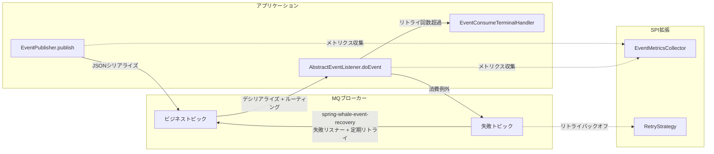
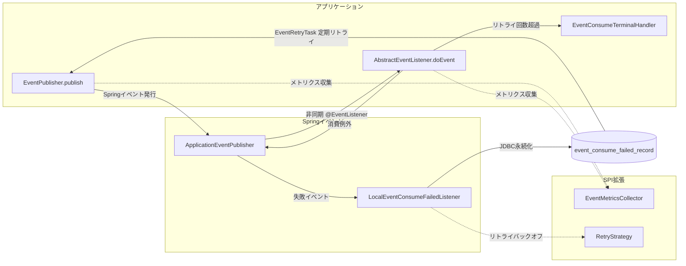

# spring-whale-event

spring-whale イベント駆動フレームワーク。ビジネスイベントのパブリッシュ、消費、失敗リトライ機能を提供します。**ローカル（Spring イベント）**、**Kafka**、**RabbitMQ** の3つのモードに対応しています。

---

## モジュール構成

| モジュール                         | 用途                                           | Maven 依存関係 |
| ---------------------------------- | ---------------------------------------------- | -------------- |
| **spring-whale-event-core**      | イベントパブリッシュ/消費機能（必須）                | 下記参照       |
| **spring-whale-event-recovery**  | 失敗イベントの復旧と永続化（オプション）             | 下記参照       |

```
spring-whale-event
├── spring-whale-event-core     イベントパブリッシュ/消費コア（ローカル / Kafka / RabbitMQ）
└── spring-whale-event-recovery   失敗イベント復旧（JDBC永続化 + 定期リトライ + クリーンアップ）
```

- イベントパブリッシュのみ → `spring-whale-event-core` のみ導入
- 失敗リトライが必要 → `spring-whale-event-recovery` を追加導入

---

## フロー概要

### リモートモード（Kafka / RabbitMQ）



### ローカルモード（Spring イベント）



> **設計上のポイント:** ローカルモードとリモートモードは完全に同一のAPI（`EventPublisher`、`AbstractEventListener`）を使用し、内部的なイベントフローも完全に一致します。モノリスからマイクロサービスへの移行時は、`spring.whale.event.mode` 設定を変更するだけで切り替えられます。

---

## コア機能

- **3モード対応**: `spring.whale.event.mode` で `local` / `kafka` / `rabbit` を切り替え可能。ローカルモードはMQ依存不要で、モノリスアプリケーションの迅速な起動に最適です。
- **統一API**: ローカル/リモート問わず、`EventPublisher` と `AbstractEventListener` のAPIは完全に一貫しており、モード切り替え時にコード変更は不要です。
- **宣言的イベント**: `@Event` アノテーションでビジネス名、バージョン、ルーティングを宣言。アノテーションがない場合は自動推論されます。
- **型安全なリスニング**: `AbstractEventListener<T>` がジェネリクス制約と実行時イベント型検証を提供します。
- **イベントバージョニング**: `@Event(version=2)` でイベントバージョンを宣言。リスナーは `supportedVersions()` で複数バージョンに対応可能です。
- **失敗リトライ**: 消費例外時に自動リトライ。固定間隔と指数バックオフの2つの戦略をサポートします。
- **メトリクス収集**: `EventMetricsCollector` SPIがパブリッシュ、消費、リトライの全ライフサイクルをカバーします。
- **分散トレーシング**: サービス間でTraceIdを自動伝播し、分散ログの一貫性を確保します。
- **ターミナルハンドリング**: `EventConsumeTerminalHandler` がリトライ回数超過後にコールバックされ、アラートや補償フローと連携可能です。

---

## クイックスタート

### 1. Maven 依存関係

```xml
<!-- コア: イベントパブリッシュ/消費（必須） -->
<dependency>
    <groupId>io.github.julianzhucode</groupId>
    <artifactId>spring-whale-event-core</artifactId>
</dependency>

<!-- オプション: 失敗リトライと永続化 -->
<dependency>
    <groupId>io.github.julianzhucode</groupId>
    <artifactId>spring-whale-event-recovery</artifactId>
</dependency>

<!-- ローカルモード: 追加のMQ依存は不要 -->
<!-- Kafkaモード: 以下の依存関係を導入 -->
<dependency>
    <groupId>org.springframework.boot</groupId>
    <artifactId>spring-boot-starter-kafka</artifactId>
</dependency>
<!-- RabbitMQモード: 以下の依存関係を導入 -->
<dependency>
    <groupId>org.springframework.boot</groupId>
    <artifactId>spring-boot-starter-amqp</artifactId>
</dependency>
```

### 2. 最小構成（application.yml）

```yaml
spring:
  whale:
    event:
      # イベントモード: local / kafka / rabbit（デフォルト: local）
      mode: local
      # ビジネスイベントトピック（デフォルト: EVENT_TOPIC、ローカルモードでは無視）
      event-topic: my_event_topic
      # 消費トピックリスト（デフォルト: event-topicと同じ、ローカルモードでは無視）
      consumer-topics: my_event_topic
      # 失敗イベントトピック（デフォルト: EVENT_FAILED_TOPIC、ローカルモードでは無視）
      failed-topic: my_event_failed_topic
      # 最大リトライ回数（デフォルト: 3）
      max-retries: 3
      # リトライ間隔（秒、デフォルト: 5）
      retry-interval-seconds: 5
      # リトライ戦略: fixed / exponential（デフォルト: fixed）
      retry-strategy: fixed
```

> **ローカルモードの特徴:** `mode: local` に設定すると、イベントのパブリッシュと消費は完全にSpringの `ApplicationEventPublisher` と `@EventListener` に基づいて動作し、MQ依存は一切不要です。APIの使い方はリモートモードと完全に同一です。後日マイクロサービスに移行する際は、`mode` を `kafka` または `rabbit` に変更し、対応するMQ依存関係を導入するだけです。

### 3. イベント定義

```java

@Data
@Event(value = "orderPaid")          // businessName = "orderPaid", version はデフォルトで 1
// @Event(value = "orderPaid", version = 2)  // イベントバージョニング用にバージョンを宣言
public class OrderPaidEvent {
    private Long orderId;
    private BigDecimal amount;
}
```

### 4. イベントパブリッシュ

```java

@Autowired
private EventPublisher eventPublisher;

// 方法1: businessName と topic を自動推論
eventPublisher.

publish(new OrderPaidEvent(...));

// 方法2: 実行時に上書き
        eventPublisher.

publish(event, PublishOption.builder()
.

topic("urgent_topic")
.

businessName("orderPaid")
.

build());
```

### 5. イベント消費

```java

@Component
public class OrderPaidListener extends AbstractEventListener<OrderPaidEvent> {

    public OrderPaidListener() {
        super(OrderPaidEvent.class);
    }

    @Override
    protected void doEvent(OrderPaidEvent event, EventContext context) {
        // ビジネスロジックを処理
        // 例外をスロー → フレームワークが自動的に失敗トピックにルーティングしてリトライ
    }
}
```

### 6. カスタムメトリクス収集（オプション）

```java

@Component
public class MyMetricsCollector implements EventMetricsCollector {
    @Override
    public void onConsumeSuccess(String businessName, String listenerName) {
        // カスタム成功カウンター
    }

    @Override
    public void onConsumeFailure(String businessName, String listenerName, Throwable error) {
        // カスタム障害アラート
    }
}
```

### 7. イベントバージョニング

```java
// ===== パブリッシャー側: イベントバージョンを宣言 =====
@Event(value = "orderPaid", version = 2)
public class OrderPaidV2Event {
    private Long orderId;
    private BigDecimal amount;
    private String paymentMethod;  // v2 で追加されたフィールド
}

// ===== コンシューマー側: 複数バージョンをサポート =====
@Component
public class OrderPaidListener extends AbstractEventListener<OrderPaidV2Event> {

    public OrderPaidListener() {
        super(OrderPaidV2Event.class);
    }

    @Override
    public int[] supportedVersions() {
        return new int[] { 1, 2 };  // v1 と v2 の両方のイベントを処理
    }

    @Override
    protected void doEvent(OrderPaidV2Event event, EventContext context) {
        // ビジネスロジックを処理
    }
}
```

> **バージョン照合ルール:** イベントの `version` がリスナーの `supportedVersions()` に含まれていない場合、スキップされます（warn レベルでログ出力）。デフォルトの `version` は `1`、デフォルトの `supportedVersions` は `{1}` のため、バージョンを宣言していないアプリケーションには影響しません。

### 8. ターミナルハンドリング（オプション）

```java

@Component
public class MyTerminalHandler implements EventConsumeTerminalHandler {
    @Override
    public void onDiscarded(EventConsumeFailedRecord record) {
        // リトライ回数超過後にアラート（Slack/メール）を送信
    }

    @Override
    public int getOrder() {
        return 1;
    }
}
```

### 9. spring-whale-event-recovery 導入時のテーブル作成

```sql
CREATE TABLE event_consume_failed_record
(
    id                     VARCHAR(64) NOT NULL PRIMARY KEY,
    message_id             VARCHAR(64),
    source                 VARCHAR(128),
    business_name          VARCHAR(128),
    listener_name          VARCHAR(128),
    authentication_context TEXT,
    topic                  VARCHAR(256),
    raw_message            TEXT,
    status                 VARCHAR(32) NOT NULL DEFAULT 'PENDING_RETRY',
    retry_count            INT                  DEFAULT 0,
    next_retry_time        TIMESTAMP,
    error_stack            TEXT,
    create_time            TIMESTAMP,
    update_time            TIMESTAMP
);
CREATE INDEX idx_event_consume_failed_record_next_retry_time
    ON event_consume_failed_record (next_retry_time);
```