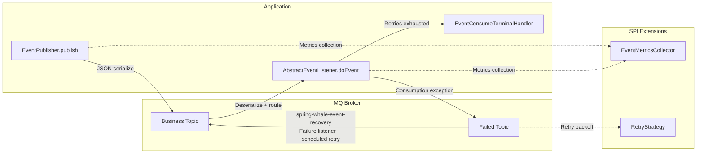
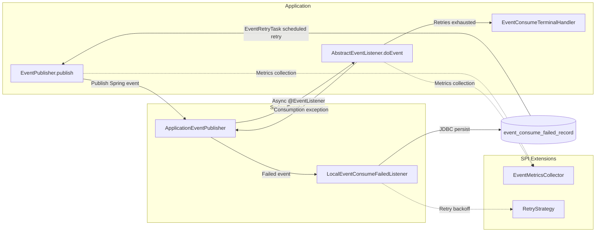

# spring-whale-event

The spring-whale event-driven framework, providing business event publishing, consumption, and failure retry capabilities. Supports **Local (Spring Events)**, **Kafka**, and **RabbitMQ** modes.

---

## Modules

| Module                           | Purpose                                      | Maven Dependency |
| -------------------------------- | -------------------------------------------- | ---------------- |
| **spring-whale-event-core**      | Event publishing/consuming capabilities (required) | See below        |
| **spring-whale-event-recovery**  | Failure recovery and persistence (optional)       | See below        |

```
spring-whale-event
├── spring-whale-event-core     Event publishing/consuming core (Local / Kafka / RabbitMQ)
└── spring-whale-event-recovery   Failure recovery (JDBC persistence + scheduled retry + cleanup)
```

- Event publishing only → include `spring-whale-event-core`
- Failure retry support → additionally include `spring-whale-event-recovery`

---

## Flow Overview

### Remote Mode (Kafka / RabbitMQ)



### Local Mode (Spring Events)



> **Key Design:** Local mode and remote mode use the exact same API (`EventPublisher`, `AbstractEventListener`), with identical internal event flow. When migrating from a monolith to microservices, simply change the `spring.whale.event.mode` configuration to switch.

---

## Core Capabilities

- **Three-mode support**: Switch between `local` / `kafka` / `rabbit` via `spring.whale.event.mode`. Local mode requires no MQ dependencies, ideal for quick startup of monolithic applications.
- **Unified API**: Regardless of local or remote mode, the `EventPublisher` and `AbstractEventListener` APIs are fully consistent. Zero code changes required for mode switching.
- **Declarative events**: `@Event` annotation declares business name, version, and routing. Automatic derivation when annotation is absent.
- **Type-safe listening**: `AbstractEventListener<T>` provides generic constraints with runtime event type validation.
- **Event versioning**: `@Event(version=2)` declares the event version. Listeners support multiple versions via `supportedVersions()`.
- **Failure retry**: Automatic retry on consumption exceptions, supporting fixed-interval and exponential backoff strategies.
- **Metrics collection**: `EventMetricsCollector` SPI covers the full lifecycle: publish, consume, and retry.
- **Distributed tracing**: Automatic TraceId propagation across services, ensuring consistent distributed logging.
- **Terminal handling**: `EventConsumeTerminalHandler` callbacks after retries are exhausted, suitable for alerting and compensation workflows.

---

## Quick Start

### 1. Maven Dependency

```xml
<!-- Core: event publishing/consuming (required) -->
<dependency>
    <groupId>io.github.julianzhucode</groupId>
    <artifactId>spring-whale-event-core</artifactId>
</dependency>

<!-- Optional: failure retry and persistence -->
<dependency>
    <groupId>io.github.julianzhucode</groupId>
    <artifactId>spring-whale-event-recovery</artifactId>
</dependency>

<!-- Local mode: no additional MQ dependencies needed -->
<!-- Kafka mode: include the following dependency -->
<dependency>
    <groupId>org.springframework.boot</groupId>
    <artifactId>spring-boot-starter-kafka</artifactId>
</dependency>
<!-- RabbitMQ mode: include the following dependency -->
<dependency>
    <groupId>org.springframework.boot</groupId>
    <artifactId>spring-boot-starter-amqp</artifactId>
</dependency>
```

### 2. Minimal Configuration (application.yml)

```yaml
spring:
  whale:
    event:
      # Event mode: local / kafka / rabbit (default: local)
      mode: local
      # Business event topic (default: EVENT_TOPIC, ignored in local mode)
      event-topic: my_event_topic
      # Consumer topic list (default: same as event-topic, ignored in local mode)
      consumer-topics: my_event_topic
      # Failed event topic (default: EVENT_FAILED_TOPIC, ignored in local mode)
      failed-topic: my_event_failed_topic
      # Maximum retry count (default: 3)
      max-retries: 3
      # Retry interval in seconds (default: 5)
      retry-interval-seconds: 5
      # Retry strategy: fixed / exponential (default: fixed)
      retry-strategy: fixed
```

> **Local mode highlights:** With `mode: local`, event publishing and consumption are entirely based on Spring's `ApplicationEventPublisher` and `@EventListener`, requiring no MQ dependencies. API usage is identical to remote mode. When migrating to microservices later, simply change `mode` to `kafka` or `rabbit` and include the corresponding MQ dependency.

### 3. Define Events

```java

@Data
@Event(value = "orderPaid")          // businessName = "orderPaid", version defaults to 1
// @Event(value = "orderPaid", version = 2)  // Declare version for event versioning
public class OrderPaidEvent {
    private Long orderId;
    private BigDecimal amount;
}
```

### 4. Publish Events

```java

@Autowired
private EventPublisher eventPublisher;

// Approach 1: auto-derive businessName and topic
eventPublisher.

publish(new OrderPaidEvent(...));

// Approach 2: runtime overrides
        eventPublisher.

publish(event, PublishOption.builder()
.

topic("urgent_topic")
.

businessName("orderPaid")
.

build());
```

### 5. Consume Events

```java

@Component
public class OrderPaidListener extends AbstractEventListener<OrderPaidEvent> {

    public OrderPaidListener() {
        super(OrderPaidEvent.class);
    }

    @Override
    protected void doEvent(OrderPaidEvent event, EventContext context) {
        // Process business logic
        // Throwing an exception → framework automatically routes to the failed topic for retry
    }
}
```

### 6. Custom Metrics Collection (Optional)

```java

@Component
public class MyMetricsCollector implements EventMetricsCollector {
    @Override
    public void onConsumeSuccess(String businessName, String listenerName) {
        // Custom success counter
    }

    @Override
    public void onConsumeFailure(String businessName, String listenerName, Throwable error) {
        // Custom failure alerting
    }
}
```

### 7. Event Versioning

```java
// ===== Publisher side: declare event version =====
@Event(value = "orderPaid", version = 2)
public class OrderPaidV2Event {
    private Long orderId;
    private BigDecimal amount;
    private String paymentMethod;  // v2 new field
}

// ===== Consumer side: support multiple versions =====
@Component
public class OrderPaidListener extends AbstractEventListener<OrderPaidV2Event> {

    public OrderPaidListener() {
        super(OrderPaidV2Event.class);
    }

    @Override
    public int[] supportedVersions() {
        return new int[] { 1, 2 };  // Handle both v1 and v2 events
    }

    @Override
    protected void doEvent(OrderPaidV2Event event, EventContext context) {
        // Process business logic
    }
}
```

> **Version matching rule:** Events with a `version` not in the listener's `supportedVersions()` are silently skipped (at warn level). The default `version` is `1` and the default `supportedVersions` is `{1}`, so applications that do not declare versions are unaffected.

### 8. Terminal Handling (Optional)

```java

@Component
public class MyTerminalHandler implements EventConsumeTerminalHandler {
    @Override
    public void onDiscarded(EventConsumeFailedRecord record) {
        // Send alert (DingTalk/email) after retries are exhausted
    }

    @Override
    public int getOrder() {
        return 1;
    }
}
```

### 9. Table Creation for spring-whale-event-recovery

```sql
CREATE TABLE event_consume_failed_record
(
    id                     VARCHAR(64) NOT NULL PRIMARY KEY,
    message_id             VARCHAR(64),
    source                 VARCHAR(128),
    business_name          VARCHAR(128),
    listener_name          VARCHAR(128),
    authentication_context TEXT,
    topic                  VARCHAR(256),
    raw_message            TEXT,
    status                 VARCHAR(32) NOT NULL DEFAULT 'PENDING_RETRY',
    retry_count            INT                  DEFAULT 0,
    next_retry_time        TIMESTAMP,
    error_stack            TEXT,
    create_time            TIMESTAMP,
    update_time            TIMESTAMP
);
CREATE INDEX idx_event_consume_failed_record_next_retry_time
    ON event_consume_failed_record (next_retry_time);
```