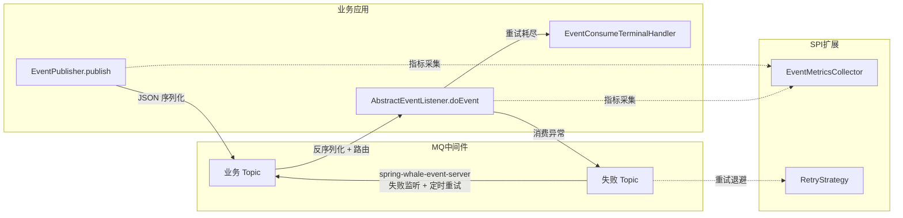

# spring-whale-event

spring-whale 事件驱动框架，提供业务事件的发布、消费、失败重试能力，支持 Kafka 和 RabbitMQ。

---

## 模块说明

| 模块                            | 场景                 | Maven 依赖 |
|-------------------------------|--------------------|----------|
| **spring-whale-event-core**   | 引入事件发布/消费能力（必须）    | 见下方      |
| **spring-whale-event-server** | 引入失败事件重试与持久化能力（可选） | 见下方      |

```
spring-whale-event
├── spring-whale-event-core    事件发布/消费核心（Kafka / RabbitMQ 双通道）
└── spring-whale-event-server  失败重试服务（JDBC 持久化 + 定时重试 + 清理）
```

- 仅需发布事件 → 只引入 `spring-whale-event-core`
- 需要失败重试 → 额外引入 `spring-whale-event-server`

---

## 流程概览



---

## 核心能力

- **双通道支持**：自动适配 Kafka 或 RabbitMQ，无需额外配置
- **声明式事件**：`@Event` 注解声明业务名和路由，无注解时自动推导
- **类型安全监听**：`AbstractEventListener<T>` 提供泛型约束，运行时校验事件类型
- **失败重试**：消费异常自动重试，支持固定间隔和指数退避两种策略
- **指标采集**：`EventMetricsCollector` SPI 覆盖发布、消费、重试全生命周期
- **链路追踪**：跨服务自动传递 TraceId，保证分布式日志连续性
- **终端处理**：`EventConsumeTerminalHandler` 在重试耗尽后回调，可对接告警、补偿流程

---

## Quick Start

### 1. Maven 依赖

```xml
<!-- 核心：事件发布/消费（必须） -->
<dependency>
    <groupId>io.github.julianzhucode</groupId>
    <artifactId>spring-whale-event-core</artifactId>
</dependency>

        <!-- 可选：失败重试与持久化 -->
<dependency>
<groupId>io.github.julianzhucode</groupId>
<artifactId>spring-whale-event-server</artifactId>
</dependency>

        <!-- 按需引入 MQ 通道 -->
<dependency>
<groupId>org.springframework.boot</groupId>
<artifactId>spring-boot-starter-kafka</artifactId>
</dependency>
        <!-- 或 -->
<dependency>
<groupId>org.springframework.boot</groupId>
<artifactId>spring-boot-starter-amqp</artifactId>
</dependency>
```

### 2. 最小配置（application.yml）

```yaml
spring:
  whale:
    event:
      # 业务事件 Topic（默认 EVENT_TOPIC）
      event-topic: my_event_topic
      # 消费的 Topic 列表（默认同 event-topic）
      consumer-topics: my_event_topic
      # 失败事件 Topic（默认 EVENT_FAILED_TOPIC）
      failed-topic: my_event_failed_topic
      # 最大重试次数（默认 3）
      max-retries: 3
      # 重试间隔（秒，默认 5）
      retry-interval-seconds: 5
      # 重试策略：fixed / exponential（默认 fixed）
      retry-strategy: fixed
```

### 3. 定义事件

```java

@Data
@Event("orderPaid")          // businessName = "orderPaid"
public class OrderPaidEvent {
    private Long orderId;
    private BigDecimal amount;
}
```

### 4. 发布事件

```java

@Autowired
private EventPublisher eventPublisher;

// 方式一：自动推导 businessName 和 topic
eventPublisher.

publish(new OrderPaidEvent(...));

// 方式二：运行时覆盖
        eventPublisher.

publish(event, PublishOption.builder()
        .

topic("urgent_topic")
        .

businessName("orderPaid")
        .

build());
```

### 5. 消费事件

```java

@Component
public class OrderPaidListener extends AbstractEventListener<OrderPaidEvent> {

    public OrderPaidListener() {
        super(OrderPaidEvent.class);
    }

    @Override
    protected void doEvent(OrderPaidEvent event, EventContext context) {
        // 处理业务逻辑
        // 抛出异常 → 框架自动路由到失败 Topic 重试
    }
}
```

### 6. 自定义指标采集（可选）

```java

@Component
public class MyMetricsCollector implements EventMetricsCollector {
    @Override
    public void onConsumeSuccess(String businessName, String listenerName) {
        // 自定义成功计数
    }

    @Override
    public void onConsumeFailure(String businessName, String listenerName, Throwable error) {
        // 自定义失败告警
    }
}
```

### 7. 终端处理（可选）

```java

@Component
public class MyTerminalHandler implements EventConsumeTerminalHandler {
    @Override
    public void onDiscarded(EventConsumeFailedRecord record) {
        // 重试耗尽后发送钉钉/邮件告警
    }

    @Override
    public int getOrder() {
        return 1;
    }
}
```

### 8. 引入 spring-whale-event-server 所需建表

```sql
CREATE TABLE event_consume_failed_record
(
    id                     VARCHAR(64) NOT NULL PRIMARY KEY,
    message_id             VARCHAR(64),
    source                 VARCHAR(128),
    business_name          VARCHAR(128),
    listener_name          VARCHAR(128),
    authentication_context TEXT,
    topic                  VARCHAR(256),
    raw_message            TEXT,
    status                 VARCHAR(32) NOT NULL DEFAULT 'PENDING_RETRY',
    retry_count            INT                  DEFAULT 0,
    next_retry_time        TIMESTAMP,
    error_stack            TEXT,
    create_time            TIMESTAMP,
    update_time            TIMESTAMP
);
CREATE INDEX idx_event_consume_failed_record_next_retry_time
    ON event_consume_failed_record (next_retry_time);
```